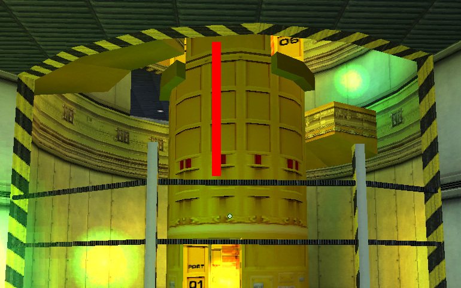

# hl1-scripts
WIP

# Table of Contents
- [Basic scripts](#a-basic-scripts)
  - [Usespam script](#1-usespam-script)
  - [Duckroll/Duckspam](#2-duckroll-aka-duckspam-script)
  - [Fps scripts](#3-fps-scripts)
    - [Hold script](#hold-script)
    - [Toggle script](#toggle-script)
    - [4 fps script](#4-fps-script)
  - [Gauss scripts](#4-gauss-scripts)
    - [180° Gauss boost](#180-gauss-boost)
    - [Alternative gauss boost func (c4a1d Interloper selfgausss)](#alternative-gauss-boost-func-c4a1d-interloper-selfgauss)
    - [Slowgauss script](#slowgauss-script)
    - [Gauss script switcher](#gauss-script-switcher)
  - [Object boost scripts](#5-object-boost-scripts)
  - [Wait table](#6-wait-table)
- [Anomalous Materials](#b-anomalous-materials)
  - [Elevator reverse scripts](#7-elevator-reverse-scripts)
    - [Elevator reverse script v1](#-elevator-reverse-script-v1)
    - [Elevator reverse script v2](#-elevator-reverse-script-v2) 
  - [Test Chamber scripts](#8-testchamber-scripts)
    - [Testchamber B](#-testchamber-b)
    - [Testchamber N](#-testchamber-n)
    - [Testchamber D](#-testchamber-d)
    - [Testchamber D v2](#-testchamber-d-v2)
- [Blast Pit](#c-blast-pit)
  - [Nade boost scripts](#9-nade-boost-scripts)
    - [Barrel bridge nade](#-barrel-bridge-nade)
    - [Maxam's nade route boost v1](#-maxams-nade-route-boost-v1)
    - [Maxam's nade route boost v1](#-maxams-nade-route-boost-v1)
    - [Slope nade boost](#-slope-nade-boost)
    - [Fire button room boost v1](#-fire-button-room-boost-v1)
    - [Fire button room boost v2](#-fire-button-room-boost-v2)
  - [HL21 box script](#10--hl21-box-script)
- [Power Up](#d-power-up)
  - [PU CLD scripts](#11-pu-cld-scripts)
    - [Power Up A](#-power-up-a)
    - [Power Up B](#-power-up-b)
    - [Power Up D](#-power-up-d)
    - [Power Up F](#-power-up-f)
- [Apprehension](#e-apprehension)
  - [Obboducktap script](#12-obboducktap-script)
  - [Captured scripts](#13--captured-scripts)
    - [Captured v1](#-captured-v1)
    - [Captured v1.2](#-captured-v12)
    - [Captured v2](#-captured-v2)
- [Residue Processing](#f-residue-processing)
    - [Meatgrab scripts](#14--meatgrab-scripts)
      - [Simple meatgrab](#-simple-meatgrab)
      - [Advanced meatgrab](#-advanced-meatgrab)
      - [2-key meatgrab v1](#-2-key-meatgrab-v1)
      - [2-key meatgrab v2](#-2-key-meatgrab-v2)
    - [RP clipping scripts](#15--rp-clipping-scripts)
      - [RP clipping 80 hp ver.](#-rp-clipping-80-hp-ver)
      - [RP clipping 75 hp ver.](#-rp-clipping-75-hp-ver)
- [Surface Tension](#g-surface-tension)
  - [ST CLD scripts](#16-st-cld-scripts)
    - [ST CLD v1](#-st-cld-v1)
    - [ST CLD v2](#-st-cld-v2)
  - [Pipe2pipe scripts](#17-pipe2pipe-scripts)
    - [Pipe2pipe script v1](#-pipe2pipe-script-v1)
    - [Pipe2pipe script v2](#-pipe2pipe-script-v2)
    - [Pipe2pipe script v3](#-pipe2pipe-script-v3)
    - [Pipe2pipe script v4](#-pipe2pipe-script-v4)
    - [Pipe2pipe script v4 2 key edition](#-pipe2pipe-script-v4-2-key-edition)
  - [Pre-IHD nade boost](#18-pre-ihd-nade-boost)
  - [Simple IHD forward boost](#19-simple-ihd-forward-boost)
  - [Gauss door setup script](#20-gauss-door-setup-script)
    
  
   


  
## A. **Basic scripts**
### 1. Usespam script
```
alias +usespam "alias _zspecial @use;@use1"
alias -usespam "alias _zspecial;-use"
alias @use1 "+use;alias @use @use2;bxt_append _zspecial"
alias @use2 "w;alias @use @use3;bxt_append _zspecial"
alias @use3 "-use;alias @use @use4;bxt_append _zspecial"
alias @use4 "w;alias @use @use1;bxt_append _zspecial"
```
Example: `bind key +usespam`\
Usage: hold the script key


### 2. Duckroll (aka Duckspam) script
*Only use this for waterboosts, `+bxt_tas_ducktap` is much better for movement purposes*
```
alias +duckroll "alias _zspecial @duck;@dr1"
alias -duckroll "alias _zspecial;-duck"
alias @dr1 "+duck;alias @duck @dr2;bxt_append _zspecial"
alias @dr2 "w;alias @duck @dr3;bxt_append _zspecial"
alias @dr3 "-duck;alias @duck @dr4;bxt_append _zspecial"
alias @dr4 "w;alias @duck @dr1;bxt_append _zspecial"
```
Example: `bind key +duckroll`\
Usage: hold the script key


### 3. Fps scripts
#### Hold script
*If you want another value, replace `20` in the `fps_max 20` command and alias names (`+/-fps_20_hold`, `fps_20_reset`)*
```
alias +fps_20_hold "fps_max 20; alias -fps_20_hold fps_20_reset"
alias fps_20_reset "fps_max 100; alias -fps_20_hold"
```
Example: `bind key +fps_20_hold`\
Usage: hold the script key to lower fps, release to change back to default
#### Toggle script
```
alias fps_20_toggle fps_20_toggle1
alias fps_20_toggle1 "fps_max 20; alias fps_20_toggle fps_20_toggle2"
alias fps_20_toggle2 "fps_max 100; alias fps_20_toggle fps_20_toggle1" 
```
Example: `bind key fps_20_toggle`\
Usage: press the script key to lower fps, press again to change back to default
#### 4 fps script
```
alias 4fpsbind "fps_max 4; w; fps_max 100"
```
Example: `bind key 4fpsbind`\
Usage: press the script key once


### 4. Gauss scripts
#### 180° Gauss boost
```
alias _taubo
alias _taubofunc "cl_pitchup 180;cl_pitchdown -180;-attack2;wait;cl_pitchup -12;cl_pitchdown 12;wait;cl_pitchup 89;cl_pitchdown 89"
alias +tau "+attack2; alias _taubo _taubofunc"
alias -tau "_taubo; alias _taubo"
```
Example: `bind key +tau`\
Usage: hold the script key to charge, release to boost
#### Alternative gauss boost func (c4a1d Interloper selfgauss)
```
alias _taubofunc2 "cl_pitchup 165;cl_pitchdown -165;-attack2;w;cl_pitchup 89;cl_pitchdown 89;force_centerview"
```
Example: `bind key "alias _taubofunc _taubofunc2"`\
Usage: either use a bind for `alias _taubofunc _taubofunc2` to change the `+tau` script behaviour or duplicate it, rename and make a rebind (`bind key "bind mouse2 +tau2"`, for example)\
[Video link](https://youtu.be/EJgwb4_xUXU)\
[Practice save](https://github.com/yavats/hl1-scripts/raw/refs/heads/main/Practice%20saves/taubofunc2.sav)
#### Slowgauss script
```
alias slowgauss "cl_pitchup 180;cl_pitchdown -180;-attack;w 50;cl_pitchup 89;cl_pitchdown 89;force_centerview"
```
Example: `bind key slowgauss`\
Usage: start charging with `mouse2`, immediately switch to `mouse1`, wait around 3s for the gauss to be fully charged and press the script key to boost. Note that the script has a 0.5s delay to make sure the shot happens (necessary due to shooting being cycle-based). Also you need to have exactly 1 or 2 ammo for this trick to work.\
[Video link](https://youtu.be/d7jesoiDjr4)\
[Practice save](https://github.com/yavats/hl1-scripts/raw/refs/heads/main/Practice%20saves/slowgauss.sav)
#### Gauss script switcher
```
alias tauswitch tauswitch1
alias tauswitch1 "bind mouse2 +tau; say gaussboost_ON; alias tauswitch tauswitch2"
alias tauswitch2 "bind mouse2 +attack2; say gaussboost_OFF; alias tauswitch tauswitch1"
```
Example: `bind key tauswitch`\
Usage: press the script key to change the `mouse2` bind to `+tau`, press again to revert the default bind (`+attack2`) back


### 5. Object Boost Scripts
#### 2000 UPS
```
alias obbo2000 "+use;w 11;-use;+jump;w;-jump"
```
Example: `bind key obbo200`
#### 1600 UPS
```
alias obbo1600 "+use;w 10;-use;+jump;w;-jump"
```
Example: `bind key obbo1600`
#### 1300 UPS
```
alias obbo1300 "+use;w 9;-use;+jump;w;-jump"
```
Example: `bind key obbo1300`
#### 1000 UPS
```
alias obbo1000 "+use;w 8;-use;+jump;w;-jump"
```
Example: `bind key obbo1000`
#### 800 UPS
```
alias obbo800 "+use;w 7;-use;+jump;w;-jump"
```
Example: `bind key obbo800`
#### Forward boost (~1300-1400 UPS)
```
alias obboshoot "+use;w 10;-use;+attack2;+jump;w;-attack2;-jump"
```
Example: `bind key obboshoot`


### 6. Wait table
*Bunnymod XT has its own built-in `w value` function, but you might still need the table below for some old scripts to work without rewriting them*
<details>
  <summary>📜Expand the table📜</summary>
  
  ```
alias "w"       "wait"
alias "w1"      "wait"
alias "w2"      "w;w"
alias "w3"      "w2;w"
alias "w4"      "w2;w2"
alias "w5"      "w4;w"
alias "w6"      "w3;w3"
alias "w7"      "w6;w"
alias "w8"      "w4;w4"
alias "w9"      "w7;w2"
alias "w10"     "w5;w5"
alias "w11"     "w9;w2"
alias "w12"     "w6;w6"
alias "w13"     "w9;w4"
alias "w14"     "w9;w5"
alias "w15"     "w9;w6"
alias "w16"     "w9;w7"
alias "w17"     "w9;w8"
alias "w18"     "w9;w9"
alias "w19"     "w9;w10"
alias "w20"     "w9;w11"
alias "w21"     "w9;w12"
alias "w22"     "w9;w13"
alias "w23"     "w9;w14"
alias "w24"     "w9;w15"
alias "w25"     "w9;w16"
alias "w26"     "w9;w17"
alias "w27"     "w9;w18"
alias "w28"     "w9;w19"
alias "w29"     "w9;w20"
alias "w30"     "w9;w21"
alias "w31"     "w9;w22"
alias "w32"     "w9;w23"
alias "w33"     "w9;w24"
alias "w34"     "w9;w25"
alias "w35"     "w9;w26"
alias "w36"     "w9;w27"
alias "w37"     "w9;w28"
alias "w38"     "w9;w29"
alias "w39"     "w9;w30"
alias "w40"     "w9;w31"
alias "w41"     "w9;w32"
alias "w42"     "w9;w33"
alias "w43"     "w9;w34"
alias "w44"     "w9;w35"
alias "w45"     "w9;w36"
alias "w46"     "w9;w37"
alias "w47"     "w9;w38"
alias "w48"     "w9;w39"
alias "w49"     "w9;w40"
alias "w50"     "w9;w41"
alias "w51"     "w50;w1"
alias "w52"     "w50;w2"
alias "w53"     "w50;w3"
alias "w54"     "w50;w4"
alias "w55"     "w50;w5"
alias "w56"     "w50;w6"
alias "w57"     "w50;w7"
alias "w58"     "w50;w8"
alias "w59"     "w50;w9"
alias "w60"     "w50;w10"
alias "w61"     "w50;w11"
alias "w62"     "w50;w12"
alias "w63"     "w50;w13"
alias "w64"     "w50;w14"
alias "w65"     "w50;w15"
alias "w66"     "w50;w16"
alias "w67"     "w50;w17"
alias "w68"     "w50;w18"
alias "w69"     "w50;w19"
alias "w70"     "w50;w20"
alias "w71"     "w50;w21"
alias "w72"     "w50;w22"
alias "w73"     "w50;w23"
alias "w74"     "w50;w24"
alias "w75"     "w50;w25"
alias "w76"     "w50;w26"
alias "w77"     "w50;w27"
alias "w78"     "w50;w28"
alias "w79"     "w50;w29"
alias "w80"     "w50;w30"
alias "w81"     "w50;w31"
alias "w82"     "w50;w32"
alias "w83"     "w50;w33"
alias "w84"     "w50;w34"
alias "w85"     "w50;w35"
alias "w86"     "w50;w36"
alias "w87"     "w50;w37"
alias "w88"     "w50;w38"
alias "w89"     "w50;w39"
alias "w90"     "w50;w40"
alias "w91"     "w50;w41"
alias "w92"     "w50;w42"
alias "w93"     "w50;w43"
alias "w94"     "w50;w44"
alias "w95"     "w50;w45"
alias "w96"     "w50;w46"
alias "w97"     "w50;w47"
alias "w98"     "w50;w48"
alias "w99"     "w50;w49"
alias "w100"    "w50;w50"
alias "w200"    "w100;w100"
alias "w300"    "w200;w100"
alias "w350"    "w300;w50"
alias "w400"    "w200;w200"
alias "w500"    "w400;w100"
alias "w600"    "w300;w300"
alias "w700"    "w600;w100"
alias "w800"    "w400;w400"
```
</details>


## **B. Anomalous Materials**

### 7. Elevator reverse scripts
#### 🔴 Elevator reverse script v1
*Made by javac_*
- Less consistent than [v2](#-elevator-reverse-script-v2)
- Faster by 0.1-0.2s
- Sometimes doesn't work even if everything was done correctly, probably has something to do with the elevator button cycles (?)

<details>
  <summary>📜Click here to view the script📜</summary>
  
```
// part 1
alias wolk1 "fps_max 100; w 50; alias wolk wolk2; alias wolkmove +moveright"
alias wolk2 "w 8; +speed; w 17; -speed; -moveright; alias wolkmove; alias wolk" 

alias wolk wolk1
alias wolkmove


// part 2
alias elev1 "fps_max 100; w 93; alias elevmove +forward; alias elev elev2" // 3
alias elev2 "force_centerview; fps_max 4; w; fps_max 100; w 10; +duck; alias elevmove +moveright; alias elev elev3" // 1 3
alias elev3 "w 29; -moveright; -forward; w 20; alias elevmove +left; alias elev elev4" // 1 3
alias elev4 "w 10; alias elevmove +forward; alias elev elev5" // 1 3
alias elev5 "+use; w; -use; w 12; -left; w 80; alias elevmove +moveright; alias elev elev6" // 1 3
alias elev6 "alias elevmove +right; alias elev elev7" // 1 3
alias elev7 "w 10; fps_max 4; w; fps_max 100; w; -forward; -duck; fps_max 4; w; fps_max 100; w 2; -moveright; -right; alias elev; alias elevmove" // 1 3

alias elev elev1
alias elevmove


// binds
bind 2 wolk
bind 4 wolkmove
bind 3 elev
bind 1 elevmove
```
</details>

<details>
  <summary>📋Usage📋</summary>

Go into the left corner, set the angles and activate the first part of the script. Wait until the elevator reaches the highest point and activate the second part.

- **Angles:**
  - Pitch: doesn't matter
  - Yaw: `89.9 - 91.0`
- **Activation timing:**
  - 1st part: any moment after pressing the elevator button
  - 2nd part: right after the elevator reaches its highest position
- **Keypresses**:
  - 1st part: `2 4 2`
  - 2nd part: `3 13 13 13 13 13 13` (`3` and then `13` six times)
</details>

[Video link](https://youtu.be/g3vjjVVva70)\
[Practice save](https://github.com/yavats/hl1-scripts/raw/refs/heads/main/Practice%20saves/elevator_reverse.sav)


#### 🟡 Elevator reverse script v2
*Made by N4rk0t1k*
- Way more consistent than [v1](#-elevator-reverse-script-v1) due to the fixed activation timing
- Slightly slower
- Still has the same button cycle timing issue as [v1](#-elevator-reverse-script-v1)
<details>
  <summary>📜Click here to view the script📜</summary>
  
```
alias amel_use "cl_pitchup 30; cl_pitchdown -30; +use; w; -use; cl_pitchup 0; w; cl_pitchup 89; cl_pitchdown 89"
alias amel_fps "fps_max 4; w; fps_max 40"
alias pre_amel "fps_max 20; -back; -moveright; -moveleft; -jump; -duck; +use; w; -use; w 50; -forward; w 23; fps_max 38; w 28; alias AMEL amel1"

alias amel1 "sensitivity 0; alias AMEL amel2; alias AMEL_MOVE +moveright" // 3
alias amel2 "w 8; -moveright; +use; w 6; -use; amel_fps; alias AMEL amel3; alias AMEL_MOVE +forward" // 1 3
alias amel3 "w 7; +duck; w 3; -forward; alias AMEL amel4; alias AMEL_MOVE +moveright" // 1 3
alias amel4 "w 10; alias AMEL amel5; alias AMEL_MOVE +forward" // 1 3
alias amel5 "w 5; -moveright; alias AMEL amel6; alias AMEL_MOVE +moveleft" // 1 3
alias amel6 "w 4; -moveleft; amel_use; w 3; -forward; w 4; amel_fps; alias AMEL amel7; alias AMEL_MOVE +moveleft" // 1 3
alias amel7 "w 10; alias AMEL amel8; alias AMEL_MOVE +forward" // 1 3
alias amel8 "w 10; -moveleft; w; alias AMEL amel9; alias AMEL_MOVE +right" // 1 3
alias amel9 "alias AMEL amel10; alias AMEL_MOVE +moveright" // 1 3
alias amel10 "w; fps_max 4; w 2; -moveright; fps_max 40; -right; -duck; -forward; fps_max 100; amel_sens; alias AMEL; alias AMEL_MOVE" // 1 3

alias AMEL
alias AMEL_MOVE


// settings
alias amel_sens "sensitivity 3"

// binds
bind mouse2 pre_amel
bind 3 AMEL
bind 1 AMEL_MOVE
```
</details>

<details>
  <summary>📋Usage📋</summary>

Hold `w` and press the `pre_amel` key (`mouse2` here) to activate the elevator button. Go into the left corner, set the angles and press the script keys.

- **Angles:**
  - Pitch: doesn't matter
  - Yaw: `90.0 - 91.0` (~`90.5` is recommended)
- **Activation timing:**
  - none (the script starts with pressing the elevator button)
- **Keypresses**:
  - `mouse2`, `3 13 13 13 13 13 13 13 13 13` (`3` and then `13` nine times), then hold `w + d`
- **Additional actions**:
  - change sensitivity in the `amel_sens` alias to your default
</details>

[Video link](https://youtu.be/CYudVS20Zxc)\
[Practice save](https://github.com/yavats/hl1-scripts/raw/refs/heads/main/Practice%20saves/elevator_reverse.sav)


### 8. Test Chamber scripts
**📝You need to execute the config with the script (`bind key "exec tc.cfg`, for example) or press the `testchamber_reset` bind (`-` by default) before doing _any_ attempt📝**

#### 🟢 Testchamber B
*Made by [Parklez](https://github.com/parklez), modified by javac_*
- Semi-automated (manual window landing)
- The most consistent version
- ~1s slower than [Testchamber D](#-testchamber-d)
- Only use this one if you can't get anything else to work
<details>
  <summary>📜Click here to view the script📜</summary>
  
```
alias testchamber "tc1"
alias tmove 
alias testchamber_reset "alias testchamber tc1; alias tmove; say tc_script_reset"

alias tc1 "w 160;alias testchamber tc2; alias tmove +back" //0+9
alias tc2 "alias testchamber tc3; alias tmove +moveright" //0+9
alias tc3 "w 30;+use;w 4;-use;w 40;-moveright;-back;w 100;alias testchamber tc4; alias tmove +left" //0+9
alias tc4 "w 6;-left;w;alias testchamber tc5; alias tmove +moveright" //0+9
alias tc5 "w 22;+use;w 11;-use;+duck;w;-duck;-moveright;w 40;alias testchamber tc6; alias tmove +back" //0+9
alias tc6 "w 13;-back;alias testchamber; alias tmove" //0

bind 0 testchamber
bind 9 tmove
bind - testchamber_reset
```
</details>

<details>
  <summary>📋Usage📋</summary>

- **Angles:**
  - Pitch: `30.0 - 40.0`
  - Yaw: `125.05 - 125.09`
- **Activation timing:**
  - right after the cage starts going down
- **Keypresses**:
  - `0 90 90 90 90 90` (`0` and then `90` five times)
- **Additional actions:**
  - turn to the left after the script is done (after you hit the wall), so you hit the trigger and land on the reactor
  - (optional, but very recommended) do the jumpbug at `23` or `30.3` fps
</details>

[Video link](https://youtu.be/-R4quekIkF4)\
[Practice save](https://github.com/yavats/hl1-scripts/raw/refs/heads/main/Practice%20saves/tc_b.sav)


#### 🟡 Testchamber N
*Made by N4Rk0t1k*
- Fully automated
- Very consistent even with fps drops
- 0.3s slower than [Testchamber D](#-testchamber-d)
- Try this one if you have performance issues that prevent you from using version D
<details>
  <summary>📜Click here to view the script📜</summary>
  
```
alias cart preboost1
alias pausespam "w; unpause; w; setpause"
alias longpausespam "pausespam; pausespam; pausespam; pausespam; pausespam; pausespam; pausespam"
alias testchamber_reset "alias cart preboost1; alias mcart; say tc_script_reset"

alias preboost1             "pausable 1; w 5; fps_max 18; w 34; alias cart preboost2; alias mcart +moveright" //0+9
alias preboost2             "+use; w 2; -use; w 12; -moveright; alias cart preboost3; alias mcart +left" //0+9
alias preboost3             "w 5; +use; w 1; -left; w 1; -use; -left; fps_max 99; w 2; alias cart cartboost; alias mcart +moveright" //0+9
alias cartboost             "w 33; +use; w 3; setpause; longpausespam; unpause; -use; w 13; fps_max 30; w 9; alias cart cartfly; alias mcart +right" //0+9
alias cartfly               "w 5; -moveright; -right; alias cart cartlanding1; alias mcart +moveleft" //0+9
alias cartlanding1          "alias mcart +left; alias cart cartlanding2" //0+9
alias cartlanding2          "speak scientist/scream20; fps_max 28.7; w 16; -moveleft; w 44; -left; +bxt_tas_jumpbug; fps_max 10; w 4; -bxt_tas_jumpbug; fps_max 100; alias cart cartwindow; alias mcart +moveright" //0+9
alias cartwindow            "w 30; -moveright; alias cart; alias mcart" //0


bind 0 cart
bind 9 mcart
bind - testchamber_reset
```
</details>

<details>
  <summary>📋Usage📋</summary>
  
- **Angles:**
  - Pitch: `30.0 - 40.0`
  - Yaw: `73.00 - 73.10` (I personally recommend .05 - 0.7, but doesn't really matter)
- **Activation timing:**
  - right after the cage starts going down
- **Keypresses:**
  - (first option) `0 90 90 90 90 90 90` (`0` and then `90` six times), wait until you hear the scientist screaming, then press `90` again and hold `w + ctrl`
  - (second option) `0 90 90 90 90 90 90 90` (`0` and `90` seven times), start holding `w + ctrl` before landing
- **Tips:**
  - Tapping `d` after the level changes helps with landing a lot
</details>

[Video link](https://youtu.be/DnRJmZiLDFM)\
[Practice save](https://github.com/yavats/hl1-scripts/raw/refs/heads/main/Practice%20saves/tc_n.sav)


#### 🟠 Testchamber D
*Made by [Parklez](https://github.com/parklez)*
- Fully automated
- May be inconsistent if you have performance issues
<details>
  <summary>📜Click here to view the script📜</summary>
  
```
alias testchamber "tc1"
alias move "+moveright"
alias testchamber_reset "alias testchamber tc1; alias move; say tc_script_reset"

alias tc1 "w 160;alias testchamber tc2;alias move +moveright" //0+9
alias tc2 "alias testchamber tc3;alias move +back" //0+9
alias tc3 "w 30;+use;wait;-moveright;wait;wait;wait;-use;alias testchamber tc4;alias move +moveright" //0+9
alias tc4 "w 70;cl_pitchup -89;+use;w 10;wait;wait;wait;wait;-use;cl_pitchup 89;-moveright;-back;cl_pitchdown 30;w 50;+use;alias testchamber tc5" //0+9
alias tc5 "w 10;wait;wait;wait;wait;-use;w 10;-moveright;w 30;cl_pitchdown 89;alias testchamber tc6;alias move +forward" //0+9
alias tc6 "cl_pitchdown 180;cl_pitchup -170;w 9;cl_pitchup 89;cl_pitchdown 40;wait;cl_pitchdown 89;-forward;w 63;alias testchamber tc7;alias move +moveleft" //0+9
alias tc7 "alias testchamber tc8;alias move +left" //0+9
alias tc8 "w 50;-moveleft;w 100;-left;fps_max 40;w 11;fps_max 100;alias testchamber tc9;alias move +forward" //0+9
alias tc9 "w 40; -forward; alias testchamber; alias move" //0


bind 9 move
bind 0 testchamber 
bind - testchamber_reset
```
</details>

<details>
  <summary>📋Usage📋</summary>
  
- **Angles:**
  - Pitch: `30.0 - 40.0`
  - Yaw: `136.45 - 136.51` (I personally recommend `.50` or `.51`, but doesn't really matter)
- **Activation timing:**
  - right after the cage starts going down
- **Keypresses:**
  - `0 90 90 90 90 90 90 90` (`0` and then `90` seven times), wait until you start turning mid-air (after you hit the trigger), then press `90` again and hold `a + ctrl`
</details>

[Video link](https://youtu.be/7QxRBDo6F8E)\
[Practice save](https://github.com/yavats/hl1-scripts/raw/refs/heads/main/Practice%20saves/tc_d.sav)


#### 🔴 Testchamber D v2
*[Testchamber D](#-testchamber-d) extended by javac_. Thanks to Razzie for the idea*
- Fully automated + extended to 4 fps the UC trigger
- 0.1s faster than [Testchamber D](#-testchamber-d)
- It's not necessary to saveload after the script
<details>
  <summary>📜Click here to view the script📜</summary>
  
```
alias testchamber "tc1"
alias move "+moveright"
alias testchamber_reset "alias testchamber tc1; alias move; say tc_script_reset"

alias tc1 "w 160;alias testchamber tc2;alias move +moveright" //0+9
alias tc2 "alias testchamber tc3;alias move +back" //0+9
alias tc3 "w 30;+use;wait;-moveright;wait;wait;wait;-use;alias testchamber tc4;alias move +moveright" //0+9
alias tc4 "w 70;cl_pitchup -89;+use;w 10;wait;wait;wait;wait;-use;cl_pitchup 89;-moveright;-back;cl_pitchdown 30;w 50;+use;alias testchamber tc5" //0+9
alias tc5 "w 10;wait;wait;wait;wait;-use;w 10;-moveright;w 30;cl_pitchdown 89;alias testchamber tc6;alias move +forward" //0+9
alias tc6 "cl_pitchdown 180;cl_pitchup -170;w 9;cl_pitchup 89;cl_pitchdown 40;wait;cl_pitchdown 89;-forward;w 63;alias testchamber tc7;alias move +moveleft" //0+9
alias tc7 "alias testchamber tc8;alias move +left" //0+9
alias tc8 "w 50;-moveleft;w 100;-left;fps_max 40;w 11;fps_max 100;alias testchamber tc9;alias move +forward" //0+9
alias tc9 "w 40; -forward; alias move +moveleft; alias testchamber tc10" //0+9
alias tc10 "+duck; w 85; -duck; alias move +left; alias testchamber tc11" //0+9
alias tc11 "w 30; fps_max 4; w; fps_max 100; w 5; -moveleft; -left; alias testchamber; alias move" //0


bind 9 move
bind 0 testchamber 
bind - testchamber_reset
```
</details>

<details>
  <summary>📋Usage📋</summary>
  
- **Angles:**
  - Pitch: `30.0 - 40.0`
  - Yaw: `136.45 - 136.51` (I personally recommend `.50 - .51`, but doesn't really matter)
- **Activation timing:**
  - right after the cage starts going down
- **Keypresses:**
  - `0 90 90 90 90 90 90 90` (`0` and then `90` seven times), wait until you start turning mid-air (after you hit the trigger), then press `90 90 90`
</details>

[Video link](https://youtu.be/mnLNYTiTWYs)\
[Practice save](https://github.com/yavats/hl1-scripts/raw/refs/heads/main/Practice%20saves/tc_d.sav)


## **C. Blast Pit**


### 9. Nade boost scripts

#### 💣 Barrel bridge nade
*Made by [Parklez](https://github.com/parklez)*
- Use with ≤ 9 armor
```
alias bp_nade "fps_max 100; cl_pitchdown 85;cl_pitchup -85;+duck;+jump;w;-attack;w 15;-jump;-duck;cl_pitchup 89;cl_pitchdown 89;force_centerview"
```
Example: `bind key bp_nade`\
Usage: walk forward and activate the script\
[Video link](https://youtu.be/6au7vtLFNBY)\
[Practice save](https://github.com/yavats/hl1-scripts/raw/refs/heads/main/Practice%20saves/bp_nade.sav)


#### 💣 Maxam's nade route boost v1
- Requirements: 51 hp, 20 armor
- Makes an autosave midair as a backup
```
alias bp_nade2 "fps_max 100; cl_pitchdown 30;cl_pitchup -30;+duck;+jump;w;-attack;w 15;-jump;-duck;cl_pitchup 89;cl_pitchdown 89;force_centerview; save autosave"
```
Example: `bind key bp_nade2`\
Usage: walk forward and activate the script\
[Video link](https://youtu.be/DkA5ik4JRn4)\
[Practice save](https://github.com/yavats/hl1-scripts/raw/refs/heads/main/Practice%20saves/bp_nade2.sav)


#### 💣 Maxam's nade route boost v2
- Requiremenets: 53 hp, 20 armor
- More consistent boost than [v1](#maxams-nade-route-boost-v1)
- Makes an autosave midair as a backup
```
alias bp_nade3 "fps_max 100; cl_pitchdown 15;cl_pitchup -15;+duck;+jump;w;-attack;w 15;-jump;-duck;cl_pitchup 89;cl_pitchdown 89;force_centerview; save autosave"
```
Example: `bind key bp_nade3`\
Usage: walk forward and activate the script\
[Video link](https://youtu.be/DkA5ik4JRn4) (same as [v1](#maxams-nade-route-boost-v1))\
[Practice save](https://github.com/yavats/hl1-scripts/raw/refs/heads/main/Practice%20saves/bp_nade2.sav)


#### 💣 Slope nade boost
- Requirements: ~30-35 hp, 20 armor
- Much more difficult execution
- Slightly faster than other scripts
```
alias bp_nade4 "fps_max 100; +jump; cl_pitchdown 89; cl_pitchup -89; -attack; w; cl_pitchup 89; force_centerview; -jump"
```
Example: `bind key bp_nade4`
<details>
  <summary>📋Usage📋</summary>

Cook a nade beforehand, gain around 600 ups, land near the slope and press the script key. DON'T JUMP ON YOUR OWN, THE SCRIPT DOES IT FOR YOU! It's highly recommended to do a jumpbug (preferably 76 fps one) before this boost to save more hp and get a good jump pattern
</details>

[Video link](https://youtu.be/pbZzpa-TUfY)\
[Practice save](https://github.com/yavats/hl1-scripts/raw/refs/heads/main/Practice%20saves/bp_nade4.sav)


#### 💥 Fire button room boost v1
- Requirements: 41 hp (may vary by +-2)
- Makes an autosave in case of failure
- Harder activation timing
```
alias bpbutton "fps_max 100; +attack2; -jump; w; weapon_handgrenade;-attack2; -moveleft; -moveright; weapon_handgrenade; w 20; cl_pitchdown 45; cl_pitchup -45; w 30; save autosave; w 10; -duck; w 30; +use; w 20; -use; w 15; +jump; w; +duck; cl_pitchdown 89; cl_pitchup 89; w; -jump; w 60; -duck"
```
Example: `bind key bpbutton`\
Usage: cook a nade a couple frames after the changelevel, start jumping as soon as you touch the ground, switch to the shotgun, keep jumping and break the bottom plank BY ACTIVATING THE SCRIPT, not with regular `+attack2`. Hold `w` during activation\
[Video link](https://youtu.be/wvnJec6XsXU)\
[Practice save](https://github.com/yavats/hl1-scripts/raw/refs/heads/main/Practice%20saves/bpbutton.sav)


#### 💥 Fire button room boost v2
- Requirements: 45 hp (may vary by +-2)
- Makes an autosave in case of failure
- Easy activation timing -> more consistent
```
alias bpbutton2 "fps_max 100; +attack2; -jump; w; weapon_handgrenade;-attack2; -moveleft; -moveright; weapon_handgrenade; w 20; cl_pitchdown 45; cl_pitchup -45; w 30; save autosave; w 10; -duck; w 30; +use; w 20; -use; w 15; +jump; w; +duck; cl_pitchdown 89; cl_pitchup 89; fps_max 7.5; w 2; -jump; fps_max 100; w 50; -duck"
```
Example: `bind key bpbutton`\
Usage: cook a nade before the changelevel, start jumping as soon as you touch the ground, switch to the shotgun, keep jumping and break the bottom plank BY ACTIVATING THE SCRIPT, not with regular `+attack2`. Hold `w` during activation\
[Video link](https://youtu.be/_Llz6Epy7OA)\
[Practice save](https://github.com/yavats/hl1-scripts/raw/refs/heads/main/Practice%20saves/bpbutton.sav)


### 10. 📦 HL21 box script
*made by javac_*\
A HL21-like script, which consists of 2 parts. The first one involves a CLD and object boost, the second one makes a turn and blows up the explosive crates. It keeps all your health so you can use it for something else (for example, [this boost](#-maxams-route-nade-boost-v1) ).

<details>
  <summary>📜Click here to view the script📜</summary>

1st part (main)
```
alias box1 "save autosave; fps_max 100; cl_pitchdown 28.7; cl_pitchup -28.7; sensitivity 0; w 100; alias boxmove +left; alias box box2" // 1
alias box2 "w 3; -left; alias boxmove +moveright; alias box box3" //2+1
alias box3 "w 22; +use; w 9; -use; w 20; +use; w 6; -use; +duck; w; -duck; w; +duck; +use; w 21; -use; -duck; w 15; +use; w 8; -use; w; +duck; w 25; -duck; w 25; +use; w 6; -use; alias boxmove +forward; alias box box4" //2+1
alias box4 "w 23; +use; w 10; -use; w 5; +use; w 8; -use; w 25; -moveright; w 10; +use; w 4; -use; w 42; -forward; w 30; alias boxmove +moveleft; alias box box5" //2+1
alias box5 "w 10; +use; w 9; -use; -moveleft; alias boxmove +right; alias box box6" //2+1
alias box6 "w 12; -right; w 53; alias boxmove +moveleft; alias box box7" //2+1
alias box7 "w 5; alias boxmove +forward; alias box box8" //2+1
alias box8 "w 7; -forward; w 25; -moveleft; w 5; alias boxmove +forward; alias box box9" //2+1
alias box9 "w 2; +use; w 11; +duck; w; -duck; w; -use; alias boxmove +moveright; alias box box10" //2+1
alias box10 "alias boxmove +right; alias box box11" //2+1
alias box11 "w 4; -right; -moveright; -forward; weapon_shotgun; bpbox_sens; cl_pitchdown 89; cl_pitchup 89; alias boxmove; alias box" //2+1
alias box box1
alias boxmove

// settings
alias bpbox_sens "sensitivity 3"

// binds
bind 1 box
bind 2 boxmove
```

2nd part (extension)
```
alias af1 "sensitivity 0; alias afmove +moveright; alias af af2" // 9
alias af2 "+jump; w 34; alias afmove +right; alias af af3" // 0+9
alias af3 "w 8; -right; +duck; w 20; alias af af4" // 0+9
alias af4 "w 4; -moveright; w 32; -right; cl_pitchup -10.5; cl_pitchdown 10.5; w 20; +attack2; w 10; -attack2; w 20; -duck; -moveright; w 17; alias afmove +moveright; alias af af5" // 0+9
alias af5 "w 9; alias afmove +right; alias af af6" // 0+9
alias af6 "w 15; -right; w 50; -moveright; -jump; cl_pitchdown 89; cl_pitchup 89; alias af; alias afmove; save autosave; bpbox_sens" // 0+9
alias af af1
alias afmove

// binds
bind 9 af
bind 0 afmove
```

</details>


<details>
  <summary>📋Usage (basic version)📋</summary>

Only uses 1st part of the script
  
- **Angles:**
  - Pitch: doesn't matter much, just aim at the box corner
  - Yaw: `262.40 - 262.71`
- **Activation timing:**
  - none
- **Keypresses:**
  - `1 21 21 21 21 21 21 21 21 21 21` (`1` and then `21` ten times) before you touch the changelevel trigger
  - Start holding `d + space` before the changelevel (but not too early)
- **Additional actions:**
  - Change sensitivity in the `bpbox_sens` alias to your default
</details>

[Video link (basic ver.)](https://youtu.be/5Sl6lXTGL60)

<details>
  <summary>📋Usage (extended version)📋</summary>

Uses both parts of the script
  
- **Angles:**
  - Pitch: doesn't matter much, just aim at the box corner
  - Yaw: `262.40 - 262.62`
- **Activation timing:**
  - 1st part: none
  - 2nd part: after touching the changelevel trigger
- **Keypresses:**
  - 1st part: `1 21 21 21 21 21 21 21 21 21 21` (`1` and then `21` ten times) before you touch the changelevel trigger
  - 2nd part: `9 09 09 09 09 09` (`9` and then `09` five times) after you touch the changelevel trigger
- **Additional actions:**
  - Change sensitivity in the `bpbox_sens` alias to your default
</details>

[Video link (extended ver.)](https://youtu.be/TkOWi8z1Aa4)

<details>
  <summary>💡Tips💡</summary>

  - (1st part) Increase waits in the `box1` alias if you don't have enough time to press the keys before hitting the changelevel trigger
  - Make sure you don't accidentally move the box by walking into it before you start the script
  - The first part of the script makes an autosave so you can load back and retry if necessary
  - The second part makes an autosave before the second changelevel
  - It's recommended to spam both scripts
  
</details>

[Practice save](https://github.com/yavats/hl1-scripts/raw/refs/heads/main/Practice%20saves/bp_box.sav)


## **D. Power Up**
  
### 11. PU CLD scripts

#### 🟡 Power Up A
*Made by [Parklez](https://github.com/parklez)*
- The most widely used one
- Backwards movement
- Does an object boost
```
alias puskip_a "fps_max 100; -jump;-moveright;-moveleft;speak fvox/power_level_is;w 100;speak fvox/beep;w 100;speak fvox/beep;w 100;speak fvox/beep;w 100;speak fvox/beep;w 100;speak fvox/beep;w 100;speak fvox/beep;cl_pitchdown 180;cl_pitchup -179;w 30;cl_pitchup -30;cl_pitchdown 31;w;cl_pitchup 89;cl_pitchdown 89;w 10;+use;w 11;-use;+jump;w;-jump; weapon_tripmine"
```
Example: `bind key puskip_a`
<details>
  <summary>📋Usage📋</summary>
  
Throw a nade under the box at 20 fps to nuke everything, walk into the changelevel trigger holding `s` and activate the script before touching it. Use mouse movement to control the character, pickup tripmines and get stuck into the corner\
Increase waits in the `w 100` commands if you don't have enough time (every `w 100` = 1s)
</details>

[Video link](https://youtu.be/IkZ4wWKrLVg)\
[Practice save](https://github.com/yavats/hl1-scripts/raw/refs/heads/main/Practice%20saves/puskip.sav)


#### 🟢 Power Up B
*Made by [Parklez](https://github.com/parklez)*
- Simplest (and slowest) version
- Facing forward
- No object boost
```
alias puskip_b "fps_max 100; speak fvox/power_level_is;w 100;speak fvox/beep;w 100;speak fvox/beep;w 100;speak fvox/beep;w 100;speak fvox/beep;w 100;speak fvox/beep;w 50; weapon_tripmine"
```
Example: `bind key puskip_b`
<details>
  <summary>📋Usage📋</summary>

Throw a nade under the box at 20 fps to nuke everything, walk into the changelevel trigger holding `w` and activate the script before touching it. Use mouse movement to control the character and go to the wall, picking up tripmines on the way\
Increase waits in the `w 100` commands if you don't have enough time (every `w 100` = 1s)
</details>

[Video link](https://youtu.be/B4_AL1Mtu4g)\
[Practice save](https://github.com/yavats/hl1-scripts/raw/refs/heads/main/Practice%20saves/puskip.sav)


#### 🟠 Power Up D
*Made by Wize*
- Facing forward
- With object boost (1400 UPS)
- Makes an autosave when activated
```
alias puskip_d "fps_max 100; save autosave;weapon_shotgun;-jump;-moveright;-moveleft;w 300;+use;w 7;-use;+jump;w;-jump;+attack2;w;-attack2;+duck;w 37;-duck;weapon_tripmine"
```
Example: `bind key puskip_d`
<details>
  <summary>📋Usage📋</summary>

Break 2 crates containing tripmines, do an object boost with [obbo1600](#1600-ups) or [obbo2000](#2000-ups) script, make sure the box you boost with doesn't get stuck! You want to push it far enough to be able to boost with it again during CLD. Hold `w` and press the script key before touching the changelevel trigger, then use mouse movement to go to the box you left behind and wait until the script ends\
Increase waits in the `w 300` command if you don't have enough time (every `w 100` = 1s)
</details>

[Video link](https://youtu.be/e4KVJcd7h14)\
[Practice save](https://github.com/yavats/hl1-scripts/raw/refs/heads/main/Practice%20saves/puskip.sav)


#### 🔴 Power Up F
*[Power Up D](#-power-up-d) modified by javac_*
- Fastest version
- Facing forward
- With object boost (1800 UPS)
- Makes an autosave when activated
```
alias puskip_f "fps_max 100; save autosave;weapon_shotgun;-jump;-moveright;-moveleft;w 300;+use;w 7;-use;+jump;w;-jump;+attack2;w;-attack2;+duck;w 37;-duck;weapon_tripmine"
```
Example: `bind key puskip_f`
<details>
  <summary>📋Usage📋</summary>

Break 2 crates containing tripmines, do an object boost with [obbo1600](#1600-ups) or [obbo2000](#2000-ups) script, make sure the box you boost with doesn't get stuck! You want to push it far enough to be able to boost with it again during CLD. Hold `w` and press the script key before touching the changelevel trigger, then use mouse movement to go to the box you left behind and wait until the script ends\
Increase waits in the `w 300` command if you don't have enough time (every `w 100` = 1s)
</details>

[Video link](https://youtu.be/5R8_ISE3k3A)\
[Practice save](https://github.com/yavats/hl1-scripts/raw/refs/heads/main/Practice%20saves/puskip.sav)


## **E. Apprehension**

### 12. Obboducktap script
```
alias app_obbo "+use; w 9; -use; w; +duck; w 8; -duck"
```
Example: `bind key app_obbo`\
Usage: drop down, hold A, press the script key. Don't stay too close to the box\
[Video link](https://youtu.be/Vu7-yZZ5hr8)\
[Practice save](https://github.com/yavats/hl1-scripts/raw/refs/heads/main/Practice%20saves/app_obbo.sav)


### 13. ⬛ Captured scripts
#### 🟡 Captured v1
*Made by [Parklez](https://github.com/parklez)*
<details>
  <summary>📜Click here to view the script📜</summary>
  
```
alias captured ct1
alias ct1 "fps_max 100;w 2205;alias captured ct2"
alias ct2 "w 164;alias captured ct3"
alias ct3 "w 6;+speed;w 21;-right;-speed;alias captured ct4"
alias ct4 "w 11;+jump;+duck;w 21;-forward;alias captured ct5"
alias ct5 "w 15;-moveright;-right;w 50;alias captured ct6"
alias ct6 "w 30;-duck;-jump;-moveleft;-left;w 40;cl_pitchdown 89.999;cl_pitchup -89.999;w;+use;w;-use;w;alias captured ct7"
alias ct7 "w;-forward;w;alias captured ct8"
alias ct8 "w;-forward;w;alias captured ct9"
alias ct9 "w;-forward;w;alias captured ct10"
alias ct10 "w;-forward;w;+use;w;-use;cl_pitchup 89;cl_pitchdown 89; alias captured"

// binds
bind 7 captured
```
</details>

<details>
  <summary>📋Usage📋</summary>

Lower fps to 8 before the changelevel, press the first script key as soon as you see the "loading..." text on the screen, then press the rest of the keys
- **Keypresses**:
```
7
s + 7
rightarrow + 7
w + 7
d + rightarrow + 7
a + leftarrow + 7
w + 7
w + 7
w + 7
w + 7   
```
  
</details>

[Video link](https://youtu.be/5-jEl8-MREc)\
[Practice save](https://github.com/yavats/hl1-scripts/raw/refs/heads/main/Practice%20saves/captured.sav)


#### 🟡 Captured v1.2
[Captured v1](#-captured-v1) 2-key edition
<details>
  <summary>📜Click here to view the script📜</summary>
  
```
alias ct1 "fps_max 100; w 2205; alias ctmove +back; alias ct ct2" // 0
alias ct2 "w 164; -back; alias ctmove +right; alias ct ct3" // 90
alias ct3 "w 6; +speed; w 21; -right; -speed; alias ctmove +forward; alias ct ct4" // 90
alias ct4 "w 11; +jump; +duck; w 21; -forward; alias ctmove +moveright; alias ct ct5" // 90
alias ct5 "alias ctmove +right; alias ct ct6" // 90
alias ct6 "w 15; -moveright; -right; w 50; alias ctmove +moveleft; alias ct ct7" // 90
alias ct7 "alias ctmove +left; alias ct ct8" // 90
alias ct8 "w 30; -duck; -jump; -moveleft; -left; w 40; cl_pitchdown 89.999; cl_pitchup -89.999; w; +use; w; -use; w; alias ctmove +forward; alias ct ct9" // 90
alias ct9 "w; -forward; w; alias ct ct10" // 90
alias ct10 "w; -forward; w; alias ct ct11" // 90
alias ct11 "w; -forward; w; alias ct ct12" // 90
alias ct12 "w; -forward; w; +use; w; -use; cl_pitchup 89; cl_pitchdown 89; alias ctmove; alias ct" // 90
alias ct ct1
alias ctmove


// binds
bind 0 ct
bind 9 ctmove
```
</details>

<details>
  <summary>📋Usage📋</summary>

Lower fps to 8 before the changelevel, press the first script key as soon as you see the "loading..." text on the screen, then press the rest of the keys
- **Keypresses**:
  - `0 90 90 90 90 90 90 90 90 90 90 90` (`0` and then `90` eleven times)
  
</details>

[Video link](https://youtu.be/XqQ8PqylHC0)\
[Practice save](https://github.com/yavats/hl1-scripts/raw/refs/heads/main/Practice%20saves/captured.sav)


#### 🟠 Captured v2
*made by javac_*
- Slightly faster
<details>
  <summary>📜Click here to view the script📜</summary>
  
```
alias capt1 "sensitivity 0; fps_max 40; w 800; alias captmv +right; alias capt capt2" // 0
alias capt2 "w 8; -right; w 8; alias captmv +back; alias capt capt3" // 90
alias capt3 "w 40; -back; w 86; fps_max 100; w 56; alias captmv +forward; alias capt capt4" // 90
alias capt4 "w 11; +jump; +duck; w 3; -forward; w 10; alias captmv +moveright; alias capt capt5" // 90
alias capt5 "alias captmv +right; alias capt capt6" // 90
alias capt6 "w 18; -right; -moveright; w 25; alias captmv +moveleft; alias capt capt7" // 90
alias capt7 "alias captmv +left; alias capt capt8" // 90
alias capt8 "w 15; -moveleft; -left; -jump; w 35; -duck; w 7; +use; w; -use; alias captmv +forward; alias capt capt9" // 90
alias capt9 "w; -forward; w; alias capt capt10" // 90
alias capt10 "w; -forward; w; alias capt capt11" // 90
alias capt11 "w; -forward; w; alias capt capt12" // 90
alias capt12 "alias captmv; w; -forward; +use; w; -use; alias capt; capt_sens" // 90
alias capt capt1
alias captmv


// settings
alias capt_sens "sensitivity 3"

// binds
bind 0 capt
bind 9 captmv
```
</details>

<details>
  <summary>📋Usage📋</summary>

Lower fps to 8 before the changelevel, press the first script key as soon as you see the "loading..." text on the screen, then press the rest of the keys
- **Keypresses**:
  - `0 90 90 90 90 90 90 90 90 90 90 90` (`0` and then `90` eleven times)
- **Additional actions**:
  - change sensitivity in the `capt_sens` alias to your default
  
</details>

[Video link](https://youtu.be/FM-C0JTUf3A)\
[Practice save](https://github.com/yavats/hl1-scripts/raw/refs/heads/main/Practice%20saves/captured.sav)


## **F. Residue Processing**

### 14. 🥩 Meatgrab scripts
#### 🟢 Simple meatgrab
```
alias meatgrab "fps_max 100;+use;w 15;-use"
```
Example: `bind key meatgrab`
<details>
  <summary>📋Usage📋</summary>

  Start holding `d` and press the script key after you pass the right edge of the meat. Ideally you want to get a 14XX UPS boost, but sometimes 1300 or 1500 will work as well. You should also delay the first jumpp in order to maintain speed and avoid fall damage. To keep the optimal speed, start holding jump key after the first drop in the pipe (when your velocity drops down do ~700)
</details>

[Video link](https://youtu.be/sa3lghAIK9E)\
[Practice save](https://github.com/yavats/hl1-scripts/raw/refs/heads/main/Practice%20saves/meatgrab.sav)


#### 🟡 Advanced meatgrab
```
alias meatgrab2 "fps_max 100; +use; w 15; -use; -moveright; w 8; +jump; w 3; -jump; fps_max 20; w 10; fps_max 100"
```
Example: `bind key meatgrab2`\
Usage: same setup as [Simple meatgrab](#-simple-meatgrab), but you can start holding `+jump` key instantly\
[Video link](https://youtu.be/Z9tLJuKtTAY)\
[Practice save](https://github.com/yavats/hl1-scripts/raw/refs/heads/main/Practice%20saves/meatgrab.sav)


#### 🟠 2-key meatgrab v1
*Made by mxpph*
```
alias mg mg1
alias mg1 "fps_max 100;+duck;w 50;alias mg mg2"
alias mg2 "+use;w 18;-use;w 20;fps_max 20;w 4;fps_max 100;-duck;alias mg mg1"
```
Example: `bind key mg`
<details>
  <summary>📋Usage📋</summary>

1. Move meat like for the regular setup, look perpendicularly (yaw ~`180`)
2. Press `key d key` in a quick  succession (`key` is the script key)
3. Hold `+jump` after the script is done  
</details>

[Video link](https://youtu.be/0LMERpfvifc)\
[Practice save](https://github.com/yavats/hl1-scripts/raw/refs/heads/main/Practice%20saves/meatgrab.sav)


#### 🔴 2-key meatgrab v2
Slightly modified [v1](#-2-key-meatgrab-v1). Higher exit speed
```
alias mtg mtg1
alias mtg1 "fps_max 100;+duck;w 50;alias mtg mtg2"
alias mtg2 "+use;w 18;-use;w 60;-duck;alias mtg mtg1"
```
Example: `bind key mtg`\
Usage: same as [v1](#-2-key-meatgrab-v1)\
[Video link](https://youtu.be/wiJWJ3Cdykc)\
[Practice save](https://github.com/yavats/hl1-scripts/raw/refs/heads/main/Practice%20saves/meatgrab.sav)


### 15. 💥 RP clipping scripts
#### 🟢 RP clipping 80 hp ver.
*Made by Tankfird & jorikgrozniy, modified by Kisimov*
- Requirements: 80 hp, 0 armor
```
alias rp_80 "cl_pitchdown 89;cl_pitchup -89;fps_max 20.2;+attack;w;weapon_crowbar;-attack;w 32;-forward; +jump; weapon_handgrenade;w;-jump;+duck;w 20;w 10;fps_max 20;w 10;-duck;fps_max 100;cl_pitchdown 89;cl_pitchup 89"
```
Example: `bind key rp_80`\
Usage: hold `w` and activate the script after you pass the gray pipe on the floor\
[Video link](https://youtu.be/Ho4tTNmveC4)\
[Practice save](https://github.com/yavats/hl1-scripts/raw/refs/heads/main/Practice%20saves/rpclipping.sav)


#### 🟡 RP clipping 75 hp ver.
*Made by javac_, [idea](https://youtu.be/RB6xVRVnwfw) by Tankfird*
- Requirements: 75 hp, 0 armor
```
alias rp_75 "fps_max 19.9; cl_pitchdown 89;cl_pitchup -89; +attack; w 30; +jump; +duck; -forward; w; -jump; w 10; fps_max 6.41; w; fps_max 19.85; w 5; -attack; w 5; cl_pitchdown -89; cl_pitchup 89; w 14; -duck; cl_pitchdown 89; force_centerview; fps_max 100"
```
Example: `bind key rp_75`\
Usage: hold `w` and activate the script after you pass the gray pipe on the floor\
[Video link](https://youtu.be/50h5JHY5WvI)\
[Practice save](https://github.com/yavats/hl1-scripts/raw/refs/heads/main/Practice%20saves/rpclipping.sav)


## **G. Surface Tension**
### 16. ST CLD scripts

#### 🟢 ST CLD v1
*Made by Wize*
- More consistent version
<details>
  <summary>📜Click here to view the script📜</summary>
  
```
alias st0 "bxt_autojump 1; fps_max 100; alias stmove +forward; w 40; alias stskip st1" // 1
alias st1 "weapon_gauss;+duck;w 146;-duck;-forward;alias stskip st2;alias stmove +moveright" // 2+1
alias st2 "+attack2;w 150;-moveright;+use;w 2;-use;alias stskip st3;alias stmove +forward" // 2+1
alias st3 "w 15;+jump;cl_pitchup 180;cl_pitchdown -180;-attack2;w;cl_pitchup 89;cl_pitchdown 89;force_centerview;-forward;w 60;alias stskip st4;alias stmove +moveright" // 2+1
alias st4 "alias stmove +right; alias stskip st5" // 2+1
alias st5 "alias stmove; w 26;-right;-moveright;w 30;-jump;cl_pitchup -89;cl_pitchdown 89;w 44;cl_pitchup 89;weapon_shotgun;alias stskip" // 2+1

alias stskip st0
alias stmove


// binds
bind 1 stskip
bind 2 stmove
```
</details>
<details>
  <summary>📋Usage📋</summary>

Switch to the gauss, aim at the cliff corner. Try to be as fast as possible to avoid getting damage. Also it's *highly* recommended to have some armor so the helicopter shots don't change player's position much (good for consistency)
- **Keypresses**: `1 21 21 21 21 21` (`1` and then `21` five times)
  
</details>

[Video link](https://youtu.be/Rf5UCa3_MP4)\
[Practice save](https://github.com/yavats/hl1-scripts/raw/refs/heads/main/Practice%20saves/st_cld.sav)


#### 🟡 ST CLD v2
*Made by javac_*
- Faster version
- Lower chance of taking damage
<details>
  <summary>📜Click here to view the script📜</summary>
  
```
alias tau "cl_pitchup 180;cl_pitchdown -180;-attack2;w;cl_pitchup 89;cl_pitchdown 89;force_centerview"
alias sst1 "bxt_autojump 1; fps_max 100; weapon_gauss; sstdelay; +attack2; alias sstmove +forward; alias sst sst2" // 2
alias sst2 "w 20; alias sstmove +moveleft; alias sst sst3" // 1+2
alias sst3 "w 90; -moveleft; w 10; -forward; alias sst sst4" //  1+2
alias sst4 "alias sstmove +left; alias sst sst5" // 1+2
alias sst5 "w 10; +jump; w 28; -left; -moveleft; w 15; tau; w 10; +attack2; w 40; alias sstmove +moveright; alias sst sst6" // 1+2
alias sst6 "alias sstmove +right; alias sst sst7" // 1+2
alias sst7 "alias sstmove; w 30; -moveright; -right; tau; w 25; -jump; cl_pitchdown 89; cl_pitchup -89; w 22; weapon_shotgun; cl_pitchup 89; alias sst" // 1+2

alias sst sst1
alias sstmove


// settings
alias sstdelay "w 100"

// binds
bind 2 sst
bind 1 sstmove
```
</details>
<details>
  <summary>📋Usage📋</summary>

Switch to the gauss, hold crouch, go into the corner, uncrouch, aim at the corner of the cliff (not really precise). Try to be as fast as possible to avoid getting damage. Also it's *highly* recommended to have some armor so the helicopter shots don't change player's position much (good for consistency)
- **Keypresses**: `2 12 12 12 12 12 12` (`2` and then `12` six times)
- **Additional actions**: increase delay in the `sstdelay` alias if you don't have enough time to press the script keys
  
</details>

[Video link](https://youtu.be/86eRINHTYZg)\
[Practice save](https://github.com/yavats/hl1-scripts/raw/refs/heads/main/Practice%20saves/st_cld.sav)


### 17. Pipe2pipe scripts
#### ⚪ Pipe2pipe script v1
*Made by jorikgrozniy*
- Doesn't cancel fall damage (~20 hp)
- Currently not used
- (added just so that people don't ask where's version 1)\
[Video link](https://youtu.be/MhjXw0nr2iI)


#### 🟢 Pipe2pipe script v2
*Made by jorikgrozniy*
- Most consistent
- Saves hp
- 2-3s slower than C2P
<details>
  <summary>📜Click here to view the script📜</summary>

```
alias ptptau "cl_pitchup 180;cl_pitchdown -180;-attack2;w;cl_pitchup 89;cl_pitchdown 89;force_centerview"
alias ptpre "say reset_script;fps_max 100;-forward;-moveleft;-moveright;-back;-duck;-jump;-right;-left;-attack2;ptpsens;alias ptpscript ptp0;alias ptpmove2;alias ptpmove1"

alias ptp0 "fps_max 100;sensitivity 0;ptpdelay;alias ptpscript ptp1;alias ptpmove1 +moveleft;alias ptpmove2 +forward" // 3 12
alias ptp1 "+attack2;w 52;-forward;-moveleft;+jump;alias ptpscript ptp2;alias ptpmove2 +moveright" // 3 2
alias ptp2 "+duck;w 70;-moveright;alias ptpscript ptp3;alias ptpmove2 +moveleft" // 3 2
alias ptp3 "-jump;w 20;-moveleft;-duck;alias ptpscript ptp4;alias ptpmove2 +right" // 3 2
alias ptp4 "w 38;-right;w 10;alias ptpscript ptp5;alias ptpmove2 +moveleft" // 3 2
alias ptp5 "w 18;-moveleft;w 10;force_centerview;alias ptpscript ptp6;alias ptpmove2 +forward" // 3 2
alias ptp6 "w 16;ptptau;w;-forward;alias ptpscript ptp7;alias ptpmove2 +moveright" // 3 2
alias ptp7 "w 10;+attack2;w 70;alias ptpscript ptp8;alias ptpmove2 +right" // 3 2
alias ptp8 "w 6;-right;-moveright;alias ptpscript ptp9;alias ptpmove2 +back" // 3 2
alias ptp9 "w 2;-back;+jump;w 70;alias ptpscript ptp10;alias ptpmove2 +left" // 3 12
alias ptp10 "w 5;-left;-moveleft;-jump;ptptau;w;save autosave;w 71;alias ptpscript ptp11;alias ptpmove2 +right;alias ptpmove1 +moveright" // 3 12
alias ptp11 "w 4;-right;w 2;-moveright;+duck;w 10;fps_max 20;+use;w 4;-duck;fps_max 100;w 15;-use;ptpsens;alias ptpscript;alias ptpmove2;alias ptpmove1" // 3

alias ptpscript ptp0
alias ptpmove2
alias ptpmove1


// settings
alias ptpsens "sensitivity 3"
alias ptpdelay "w 100"

// binds
bind 3 ptpscript
bind 2 ptpmove2
bind 1 ptpmove1
bind - ptpre
```
</details>

<details>
  <summary>📋Usage📋</summary>

1. Set the angles (it's recommended to do this before anything else)
2. Start charging gauss before activating the script (3-4 ammo should be enough). Don't start charging on the previous map, you only waste ammo by doing this!
3. Go into the left corner and press the first script key, then you can release `+attack2`. Press the remaining keys

- **Angles**:
  - Pitch: around `-1` (doesn't really matter)
  - Yaw: `268.70 - 268.90` (`.8x` is recommended)
- **Keypresses:**
```
3
123
23 23 23 23 23 23 23 23 (x8)
123
123
```
- **Additional actions:**
  - Change sensitivity in the `ptpsens` alias to your default
  - Increase delay in the `ptpdelay` alias if you don't have enough time to press the script keys (every `w 100` = 1s)
  - You can reset the script with `ptpre` bind instead of re-executing the whole config
</details>

[Video link](https://youtu.be/ZZV663fXqMs)\
[Practice save](https://github.com/yavats/hl1-scripts/raw/refs/heads/main/Practice%20saves/p2p.sav)


#### 🟡 Pipe2pipe script v3
*[P2P script v2](#-pipe2pipe-script-v2) modified and extended by javac_*
- 600 UPS into the pipe
- Saves hp
- As fast as C2P
<details>
  <summary>📜Click here to view the script📜</summary>

```
alias p2ptau "cl_pitchup 180;cl_pitchdown -180;-attack2;w;cl_pitchup 89;cl_pitchdown 89;force_centerview"
alias p2pre "say reset_script; -forward; -moveleft; -moveright; -back; -right; -left; -duck; -jump; fps_max 100; cl_pitchdown 89; cl_pitchup 89; p2psens; alias p2p p2p1; alias p2pmv2; alias p2pmv1"

alias p2p1 "fps_max 100; -moveleft; -back; cl_pitchup 1.41; cl_pitchdown -1.41; sensitivity 0; p2pdelay; alias p2pmv1 +moveleft; alias p2pmv2 +forward; alias p2p p2p2" // 3 12
alias p2p2 "+attack2; w 52; cl_pitchup 89; cl_pitchdown 89; -forward; -moveleft; +jump; alias p2pmv1; alias p2pmv2 +moveright; alias p2p p2p3" // 3 2
alias p2p3 "+duck; w 70; -moveright; alias p2pmv2 +moveleft; alias p2p p2p4" // 3 2
alias p2p4 "-jump; w 20; -moveleft; -duck; alias p2pmv2 +right; alias p2p p2p5" // 3 2
alias p2p5 "w 38; -right; w 10; alias p2pmv2 +moveleft; alias p2p p2p6" // 3 2
alias p2p6 "w 18; -moveleft; w 10; force_centerview; alias p2pmv2 +forward; alias p2p p2p7" // 3 2
alias p2p7 "w 16; p2ptau; w; -forward; alias p2pmv2 +moveright; alias p2p p2p8" // 3 2
alias p2p8 "+attack2; w 80; alias p2pmv2 +right; alias p2p p2p9" // 3 2
alias p2p9 "w 6; -right; -moveright; alias p2pmv2 +back; alias p2p p2p10" // 3 2
alias p2p10 "w 2; -back; +jump; w 59; alias p2pmv1 +left; alias p2pmv2 +moveleft; alias p2p p2p11" // 3 12
alias p2p11 "w 10; -left; -moveleft; -jump; w; p2ptau; w; +attack2; w 10; alias p2p p2p12" // 3 12
alias p2p12 "w 2; -left; w 20; -moveleft; w 6; alias p2pmv1 +moveright; alias p2pmv2 +right; alias p2p p2p13" // 3 12
alias p2p13 "w 4; -right; w 11; alias p2pmv1; alias p2p p2p14" // 3 2
alias p2p14 "w 4; -right; w 11; alias p2p p2p15" // 3 2
alias p2p15 "w 4; -right; w 11; alias p2p p2p16" // 3 2
alias p2p16 "w 12; -right; +duck; +jump; w; p2ptau; w 30; -jump; -duck; -moveright; fps_max 100; p2psens; alias p2p; alias p2pmv2" // 3

alias p2p p2p1
alias p2pmv2
alias p2pmv1


// settings
alias p2psens "sensitivity 3"
alias p2pdelay "w 100"

// binds
bind 3 p2p
bind 2 p2pmv2
bind 1 p2pmv1
bind - p2pre
```
</details>

<details>
  <summary>📋Usage📋</summary>

1. Set the angles (it's recommended to do this before anything else)
2. Start charging gauss before activating the script (3-4 ammo should be enough). Don't start charging on the previous map, you only waste ammo by doing this!
3. Go into the left corner and press the first script key, then you can release `+attack2`. Press the remaining keys
4. Hold `+jump` after the script is done

- **Angles**:
  - Pitch: around `-1` (doesn't really matter)
  - Yaw: `268.69 - 268.90` (`.76 - .86` is recommended)
- **Keypresses:**
```
3
123
23 23 23 23 23 23 23 23 (x8)
123 123 123
23 23 23
```
- **Additional actions:**
  - Change sensitivity in the `p2psens` alias to your default
  - Increase delay in the `p2pdelay` alias if you don't have enough time to press the script keys (every `w 100` = 1s)
  - You can reset the script with `p2pre` bind instead of re-executing the whole config
</details>

[Video link](https://youtu.be/Ox6OqOg4Izs)\
[Practice save](https://github.com/yavats/hl1-scripts/raw/refs/heads/main/Practice%20saves/p2p.sav)


#### 🔴 Pipe2pipe script v4
*Made by javac_*
- 800 UPS into the pipe
- Saves hp
- Uses less gauss ammo
- Fastest version
<details>
  <summary>📜Click here to view the script📜</summary>

```
alias p2ptau "cl_pitchup 180;cl_pitchdown -180;-attack2;w;cl_pitchup 89;cl_pitchdown 89;force_centerview"
alias p2pre "say reset_script; p2pbind1; p2pbind2; p2pbind3; -forward; -moveleft; -moveright; -right; -left; -back; -duck; -jump; fps_max 100; cl_pitchdown 89; cl_pitchup 89; p2psens; alias p2p p2p1"

alias p2p1 "fps_max 100; bxt_disable_autosave 1; save autosave; -moveright; -forward; -back; -moveleft; sensitivity 0; p2pdelay; alias p2pmv1 +moveleft; alias p2pmv2 +forward; alias p2p p2p2" // 3 12
alias p2p2 "+attack2; w 52; -forward; -moveleft; +jump; alias p2pmv1; alias p2pmv2 +moveright; alias p2p p2p3" // 3 2
alias p2p3 "+duck; w 70; -moveright; alias p2pmv2 +moveleft; alias p2p p2p4" // 3 2
alias p2p4 "-jump; w 20; -moveleft; -duck; alias p2pmv2 +right; alias p2p p2p5" // 3 2
alias p2p5 "w 38; -right; w 10; alias p2pmv2 +moveleft; alias p2p p2p6" // 3 2
alias p2p6 "w 18; -moveleft; w 10; force_centerview; alias p2pmv2 +forward; alias p2p p2p7" // 3 2
alias p2p7 "w 16; p2ptau; w; -forward; alias p2pmv2 +moveright; alias p2p p2p8" // 3 2
alias p2p8 "w 6; +attack2; w 62; alias p2pmv2 +moveright; alias p2p p2p9" // 3 2
alias p2p9 "w 8; alias p2pmv2 +right; alias p2p p2p10" // 3 2
alias p2p10 "w 3; -right; w 13; alias p2p p2p11" // 3 2
alias p2p11 "w 3; -right; w 13; alias p2p p2p12" // 3 2
alias p2p12 "w 3; -right; +jump; w 30; -moveright; alias p2pmv1 +moveleft; alias p2pmv2 +left; alias p2p p2p13" // 3 12
alias p2p13 "w 3; -left; w 3; alias p2p p2p14" // 3 2
alias p2p14 "w 3; -left; w 3; alias p2p p2p15" // 3 2
alias p2p15 "w 8; -left; w 24; p2ptau; w 10; alias p2p p2p16" // 3 2
alias p2p16 "w 3; -left; -moveleft; w 10; alias p2pmv1 +moveright; alias p2pmv2 +right; alias p2p p2p17" // 3 12
alias p2p17 "w 8; -right; w 6; alias p2pmv1; alias p2p p2p18" // 3 2
alias p2p18 "w 6; -right; w 14; alias p2p p2p19" // 3 2
alias p2p19 "w 5; -right; w 4; alias p2p p2p20" // 3 2
alias p2p20 "w 8; -right; w; alias p2p p2p21" // 3 2
alias p2p21 "w 8; +duck; -right; fps_max 20; w 12; -moveright; -duck; -jump; fps_max 100; alias p2p; alias p2pmv2; p2psens; bxt_disable_autosave 0; defbind1; defbind2; defbind3" // 3

alias p2p p2p1
alias p2pmv2
alias p2pmv1


// settings
alias p2pdelay "w 100"
alias p2psens "sensitivity 3"


// script binds
alias p2pbind1 "bind 1 p2pmv1"
alias p2pbind2 "bind 2 p2pmv2"
alias p2pbind3 "bind 3 p2p"

p2pbind1; p2pbind2; p2pbind3

// default binds for the same keys
alias defbind1 "bind 1 weapon_crowbar"
alias defbind2 "bind 2 slot2"
alias defbind3 "bind 3 weapon_9mmAR"

bind - p2pre
```
</details>

<details>
  <summary>📋Usage📋</summary>

0. IT'S HIGHLY RECOMMENDED TO HAVE A SEPARATE CONFIG FOR THIS SCRIPT! Execute it before any attempt with a bind like this: `bind key "exec p2pv4.cfg"`
1. Set the angles (it's recommended to do this before anything else)
2. Start charging gauss before activating the script (3-4 ammo should be enough). Don't start charging on the previous map, you only waste ammo by doing this!
3. Go into the left corner and press the first script key, then you can release `+attack2`. Press the remaining keys
4. Hold `+jump` after the script is done

- **Angles**:
  - Pitch: around `-1` (doesn't really matter)
  - Yaw: `268.69 - 268.85` (`.7x` is recommended)
- **Keypresses:**
```
3
123
23 23 23 23 23 23 23 23 23 23 (x10)
123
23 23 23
123
23 23 23 23 23
```
- **Additional actions:**
  - Change sensitivity in the `p2psens` alias to your default
  - Increase delay in the `p2pdelay` alias if you don't have enough time to press the script keys (every `w 100` = 1s)
  - You can reset the script with `p2pre` bind instead of re-executing the whole config
</details>

[Video link](https://youtu.be/ynC9b9_VrNg)\
[Practice save](https://github.com/yavats/hl1-scripts/raw/refs/heads/main/Practice%20saves/p2p.sav)


#### 🔴 Pipe2pipe script v4 2-key edition
*Made by javac_*
- 800 UPS into the pipe
- Saves hp
- Uses less gauss ammo
- Fastest version
<details>
  <summary>📜Click here to view the script📜</summary>

```
alias p2ptau "cl_pitchup 180;cl_pitchdown -180;-attack2;w;cl_pitchup 89;cl_pitchdown 89;force_centerview"
alias p2pre "say reset_script; p2pbind1; p2pbind2; -forward; -moveleft; -moveright; -right; -left; -back; -duck; -jump; fps_max 100; cl_pitchdown 89; cl_pitchup 89; p2psens; alias p2p p2p1"

alias p2p1 "fps_max 100; bxt_disable_autosave 1; save autosave; -moveright; -forward; -back; -moveleft; sensitivity 0; p2pdelay; alias p2pmv +forward; alias p2p p2p2" // 2
alias p2p2 "alias p2pmv +moveleft; alias p2p p2p3" // 1 2
alias p2p3 "+attack2; w 52; -forward; -moveleft; +jump; alias p2pmv +moveright; alias p2p p2p4" // 1 2
alias p2p4 "+duck; w 70; -moveright; alias p2pmv +moveleft; alias p2p p2p5" // 1 2
alias p2p5 "-jump; w 20; -moveleft; -duck; alias p2pmv +right; alias p2p p2p6" // 1 2
alias p2p6 "w 38; -right; w 10; alias p2pmv +moveleft; alias p2p p2p7" // 1 2
alias p2p7 "w 18; -moveleft; w 10; force_centerview; alias p2pmv +forward; alias p2p p2p8" // 1 2
alias p2p8 "w 16; p2ptau; w; -forward; alias p2pmv +moveright; alias p2p p2p9" // 1 2
alias p2p9 "w 6; +attack2; w 62; alias p2pmv +moveright; alias p2p p2p10" // 1 2
alias p2p10 "w 8; alias p2pmv +right; alias p2p p2p11" // 1 2
alias p2p11 "w 3; -right; w 13; alias p2p p2p12" // 1 2
alias p2p12 "w 3; -right; w 13; alias p2p p2p13" // 1 2
alias p2p13 "w 3; -right; +jump; w 30; -moveright; alias p2pmv +moveleft; alias p2p p2p14" // 1 2
alias p2p14 "alias p2pmv +left; alias p2p p2p15" // 1 2
alias p2p15 "w 3; -left; w 3; alias p2p p2p16" // 1 2
alias p2p16 "w 3; -left; w 3; alias p2p p2p17" // 1 2
alias p2p17 "w 8; -left; w 24; p2ptau; w 10; alias p2p p2p18" // 1 2
alias p2p18 "w 3; -left; -moveleft; w 10; alias p2pmv +moveright; alias p2p p2p19" // 1 2
alias p2p19 "alias p2pmv +right; alias p2p p2p20" // 1 2
alias p2p20 "w 8; -right; w 6; alias p2p p2p21" // 1 2
alias p2p21 "w 6; -right; w 14; alias p2p p2p22" // 1 2
alias p2p22 "w 5; -right; w 4; alias p2p p2p23" // 1 2
alias p2p23 "w 8; -right; w; alias p2p p2p24" // 1 2
alias p2p24 "w 8; +duck; -right; fps_max 20; w 12; -moveright; -duck; -jump; fps_max 100; alias p2p; alias p2pmv; p2psens; bxt_disable_autosave 0; defbind1; defbind2" // 1 2

alias p2p p2p1


// settings
alias p2pdelay "w 100"
alias p2psens "sensitivity 3"


// script binds
alias p2pbind1 "bind 1 p2pmv"
alias p2pbind2 "bind 2 p2p"

p2pbind1; p2pbind2

// default binds for the same keys
alias defbind1 "bind 1 weapon_crowbar"
alias defbind2 "bind 2 slot2"

bind - p2pre
```
</details>

<details>
  <summary>📋Usage📋</summary>

0. IT'S HIGHLY RECOMMENDED TO HAVE A SEPARATE CONFIG FOR THIS SCRIPT! Execute it before any attempt with a bind like this: `bind key "exec p2pv4.cfg"`
1. Set the angles (it's recommended to do this before anything else)
2. Start charging gauss before activating the script (3-4 ammo should be enough). Don't start charging on the previous map, you only waste ammo by doing this!
3. Go into the left corner and press the first script key, then you can release `+attack2`. Press the remaining keys
4. Hold `+jump` after the script is done

- **Angles**:
  - Pitch: around `-1` (doesn't really matter)
  - Yaw: `268.69 - 268.85` (`.7x` is recommended)
- **Keypresses:** `2 12 12 12 12 12 12 12 12 12 12 12 12 12 12 12 12 12 12 12 12 12 12 12` (`2` and then `12` twenty three times)
- **Additional actions:**
  - Change sensitivity in the `p2psens` alias to your default
  - Increase delay in the `p2pdelay` alias if you don't have enough time to press the script keys (every `w 100` = 1s)
  - You can reset the script with `p2pre` bind instead of re-executing the whole config
</details>

[Video link](https://youtu.be/tF90SY2WXso)\
[Practice save](https://github.com/yavats/hl1-scripts/raw/refs/heads/main/Practice%20saves/p2p.sav)


### 18. Pre-IHD nade boost
*Made by hsci*
```
alias stboost "+duck; w 18; cl_pitchup -96; cl_pitchdown -180; w; +attack2; w; -attack2; w 2; -duck; cl_pitchup 89; cl_pitchdown 89; force_centerview; weapon_gauss"
```
Example: `bind key stboost`\
Usage: hold +jump and press the script key on the slope. Having at least 1100 ups is recommended\
[Video link](https://youtu.be/SCDMUGy1FSA)\
[Practice save](https://github.com/yavats/hl1-scripts/raw/refs/heads/main/Practice%20saves/stboost.sav)


### 19. Simple IHD forward boost

```
alias ihd ihd1
alias ihd1 "w 30; alias ihd ihd2" 
alias ihd2 "w 8; cl_pitchup 180; cl_pitchdown -180; -attack2; w; cl_pitchup 89; cl_pitchdown 89; force_centerview; w; -forward; alias ihd ihd1" 
```
Example: `bind key ihd`\
Usage: Charge the gauss, press `key w key` (`key` is the script key)\
[Video link](https://youtu.be/kE_0KCV0J3s)\
[Practice save](https://github.com/yavats/hl1-scripts/raw/refs/heads/main/Practice%20saves/ihd.sav)


### 20. Gauss door setup script
*Made by javac, [setup](https://youtu.be/WJnYII1Z724?t=64) by MarQ*
<details>
  <summary>📜Click here to view the script📜</summary>

```
alias +doorsetup "fps_max 100; +duck; +use; cl_pitchdown -16.69; cl_pitchup 16.69; doorfov; doorcross; doorsens; alias _doorsetup _doorsetupfunc"
alias _doorsetup
alias _doorsetupfunc "-duck; -use; cl_pitchdown 89; cl_pitchup 89; deffov; defcross; defsens; weapon_handgrenade"
alias -doorsetup "_doorsetup; alias _doorsetup"
alias doorcross "bxt_cross 1; bxt_cross_top_line 0; bxt_cross_left_line 0; bxt_cross_bottom_line 0; bxt_cross_right_line 1; bxt_cross_size 32"


// settings
alias defsens "sensitivity 3" // your default sens
alias doorsens "sensitivity 0.5" // low sens
alias deffov "default_fov 110" // your default fov
alias doorfov "default_fov 30" // low fow
alias defcross "bxt_cross 0" // your default bxt_cross settings (if you use it)


// binds
bind key +doorsetup
```
</details>

<details>
  <summary>📋Usage📋</summary>

0. Change `defsens`, `doorsens`, `deffov`, `doorfov` and `defcross` settings
1. Charge the gauss, go into the corner, start holding the script key
2. Aim at the right spot and shoot. The script is configured so that at full HD the crosshair line just barely crosses the vertical line between 3rd and 2nd pixels from the right when you look at the correct spot. Yaw: `34.18 - 34.39`
</details> 

[Video link](https://youtu.be/G_yYuyRoBFs)\
[Practice save](https://github.com/yavats/hl1-scripts/raw/refs/heads/main/Practice%20saves/slowgauss.sav)


## **H. Forget About Freeman**
### 21. FAF CLD scripts


#### 🟢 Forget About Freeman A
*Made by [Parklez](https://github.com/parklez)*
- Crowbar + handgrenade boost version
- Doesn't scare the vortigaunts off
```
alias faf_a "fps_max 100;speak fvox/power_level_is.beep._comma.beep._comma.beep._comma.beep;-moveright;-moveleft;-duck;weapon_crowbar;+attack;w 500;weapon_handgrenade;w 40;cl_pitchdown 180;cl_pitchup -179;w 40;cl_pitchup 89.999;cl_pitchdown 89.999;cl_pitchup -40;cl_pitchdown 40.001;w 30;-attack;w 4;+jump;+duck;w;-jump;-duck;cl_pitchup 89;cl_pitchdown 89;w 61"
```
Example: `bind key faf_a`
<details>
  <summary>📋Usage📋</summary>
  
(optional) Kill the vortigaunts or scare them off with and smg nade\
Cook a nade, hold `w` or `w + a` / `w + d` to go down the ladder, activate the script before touching the changelevel trigger. Use mouse movement to control your character, climb up, go into the corner and aim at the vertical line on the wall (yaw ~184).\
If you don't have enough time to do the script, increase waits in the `w 500` command. Every `w 100` = 1s.
</details>

[Video link](https://youtu.be/E4h4jmzd-gI)\
[Practice save](https://github.com/yavats/hl1-scripts/raw/refs/heads/main/Practice%20saves/faf.sav)


#### 🟢 Forget About Freeman C
- Crowbar + smg nade + handgrenade boost version
- Auto nade charge
- Most consistent version
```
alias faf_c "fps_max 100;weapon_handgrenade;w 10;speak fvox/power_level_is.beep._comma.beep._comma.beep._comma.beep;-moveright;-moveleft;-duck;+attack; w 50; weapon_crowbar;w 250;weapon_9mmAR;w 100;smg_c;w;weapon_handgrenade;w 10;+attack;w 50;cl_pitchdown 180;cl_pitchup -179;w 40;cl_pitchup 89.999;cl_pitchdown 89.999;cl_pitchup -40;cl_pitchdown 40.001;w 30;-attack;w 4;+jump;+duck;w;-jump;-duck;cl_pitchup 89;cl_pitchdown 89;w 61;weapon_shotgun"
alias smg_c "cl_pitchdown 180;cl_pitchup -179;w;+attack2;w;cl_pitchup 89;cl_pitchdown 89;-attack2"
```
Example: `bind key faf_c`
<details>
  <summary>📋Usage📋</summary>

Hold `w` or `w + a` / `w + d` to go down the ladder, activate the script before touching the changelevel trigger. Use mouse movement to control your character, climb up, go into the corner and aim at the vertical line on the wall (yaw ~184).\
If you don't have enough time to do the script, increase waits in the `w 250` command. Every `w 100` = 1s.
</details>

[Video link](https://youtu.be/8dKdXEbiIAc)\
[Practice save](https://github.com/yavats/hl1-scripts/raw/refs/heads/main/Practice%20saves/faf.sav)


#### 🟡 Forget About Freeman D
*Made by Wize*
- Crowbar + smg nade boost version
- Faster
- Less consistent
```
alias "faf_d" "fps_max 100;save autosave;weapon_crowbar;-moveleft;-moveright;+attack;w 400;-attack;weapon_9mmAR;cl_pitchdown 180;cl_pitchup -179;w 40;cl_pitchup 89;cl_pitchdown 89;w 30;+jump;+duck;w;cl_pitchdown 136;cl_pitchup -135;-forward;+attack2;w 30;-attack2;cl_pitchup 89;cl_pitchdown 89;force_centerview;-jump;-duck;w 26; weapon_hornetgun"
```
Example: `bind key faf_d`
<details>
  <summary>📋Usage📋</summary>

Hold `w` or `w + a` / `w + d` to go down the ladder, activate the script before touching the changelevel trigger. Use mouse movement to control your character, climb up, go into the corner and aim at the vertical line on the wall (yaw ~184).\
If you don't have enough time to do the script, increase waits in the `w 400` command. Every `w 100` = 1s.\
Crouching during changelevel seems to lower the chance of getting stuck in the wall
</details>

[Video link](https://youtu.be/X7T9iaG2V3w)\
[Practice save](https://github.com/yavats/hl1-scripts/raw/refs/heads/main/Practice%20saves/faf.sav)


#### 🟠 Forget About Freeman E
*[FAF D](#-forget-about-freeman-d) modified by Kisimov*
- Crowbar + smg nade boost version
- Even faster
- More consistent
```
alias "faf_e" "fps_max 100;save autosave;-moveleft;-moveright;weapon_crowbar;+attack;w 350;-attack;force_centerview;weapon_9mmAR;cl_pitchdown 180;cl_pitchup -179;w 40;cl_pitchup 89;cl_pitchdown 89;w 30;+jump;+duck;w;cl_pitchdown 136;cl_pitchup -135;-forward;+attack2;w 30;-attack2;cl_pitchup 89;cl_pitchdown 89;force_centerview;-jump;-duck;w 10;+duck;w 16;-duck;weapon_hornetgun"
```
Example: `bind key faf_e`
<details>
  <summary>📋Usage📋</summary>

Hold `w` or `w + a` / `w + d` to go down the ladder, activate the script before touching the changelevel trigger. Use mouse movement to control your character, climb up, go into the corner and aim at the vertical line on the wall (yaw ~184).\
If you don't have enough time to do the script, increase waits in the `w 350` command. Every `w 100` = 1s.
</details>

[Video link](https://youtu.be/X7T9iaG2V3w)\
[Practice save](https://github.com/yavats/hl1-scripts/raw/refs/heads/main/Practice%20saves/faf.sav)


#### 🔴 Forget About Freeman F
*[FAF E](-forget-about-freeman-e) ladderstrafe ver.*
- Crowbar + smg nade boost version
- Fastest one
- Consistent[*](https://www.twitch.tv/gratedastroex/clip/EphemeralRamshackleNuggetsDeIlluminati-_-x35L64CdtDHa8d) if no snarks have spawned
```
alias "faf_f" "cl_pitchup 89.999;fps_max 100;save autosave;weapon_crowbar;+attack;w 100;-moveleft;-moveright;w 180;-attack;force_centerview;weapon_9mmAR;cl_pitchdown 180;cl_pitchup -179;w 40;cl_pitchup 89;cl_pitchdown 89;w 30;+jump;+duck;w;cl_pitchdown 136;cl_pitchup -135;-forward;+attack2;w 30;-attack2;cl_pitchup 89;cl_pitchdown 89;force_centerview;-jump;-duck;w 10;+duck;w 16;-duck;weapon_hornetgun"
```
Example: `bind key faf_f`
<details>
  <summary>📋Usage📋</summary>

Hold `w + a` / `w + d` to go down the ladder, activate the script before touching the changelevel trigger. Use mouse movement to control your character, climb up (note that you'll move really fast the first few moments), go into the corner and aim at the vertical line on the wall (yaw ~184). It's HIGHLY recommended to despawn snarks by saveloading when the hatch crosses the snark mine.\
If you don't have enough time to do the script, increase waits in the `w 100` or `w 180` command (depends on what part of the script you need more time for; `w 100` is for the ladderstrafe part, `w 180` is for the rest). Every `w 100` = 1s.
</details>

[Video link](https://youtu.be/_r7b_2CwO-I)\
[Practice save](https://github.com/yavats/hl1-scripts/raw/refs/heads/main/Practice%20saves/faf.sav)


## **I. Lambda Core**


### 22. Door frame nade boost
*Made by hsci & javac_*
```
alias lcboost "fps_max 100; cl_pitchdown -20; cl_pitchup 20; +duck; +jump; w 5; -attack; w 15; -jump; cl_pitchup 89; cl_pitchdown 89; w 30; -duck"
```
Example: `bind key lcboost`\
Usage: Cook a nade, open the door, aim slightly to the right and activate the script right before you pass the doorframe\
[Video link](https://youtu.be/BdP288HnmgA)\
[Practice save](https://github.com/yavats/hl1-scripts/raw/refs/heads/main/Practice%20saves/lcboost.sav)


### 23. Water clipping nade scripts

#### 🟢 Simple nade clipping
*Made by N4rk0t1k*
- Prevents nukes
```
alias lc_pipe_skip "-forward; -moveright; -moveleft; -back; -jump; -duck; cl_pitchup -170; cl_pitchdown 170; fps_max 19.99; +duck; w; -duck; w; +duck; -attack; w 5; -duck; fps_max 100; cl_pitchup -12; cl_pitchdown 12; w; cl_pitchup 89; cl_pitchdown 89" 
```
Example: `bind key lc_pipe_skip`\
Usage: Cook a nade, drop into the water, hold `w`, look perpendicular to the pipe, start holding `+duck` and activate the script. Alternatively, you can hold `+duck` and tap `+jump` before pressing the script key\
[Video link](https://youtu.be/-IsroM843jU)\
[Practice save](https://github.com/yavats/hl1-scripts/raw/refs/heads/main/Practice%20saves/lc_clipping.sav)


#### 🟡 Advanced nade clipping
*Made by Kisimov*
- Prevents nukes
- Automatically switches to nades => no need to hold `+attack`
- Doesn't require tapping `+duck`/`+jump`
```
alias nadeclip "fps_max 100; weapon_handgrenade; w 5; -attack; w 90; -forward; force_centerview; cl_pitchup -190; cl_pitchdown -190; fps_max 19.99; w 4; fps_max 100; cl_pitchup 0;cl_pitchdown 0;w;cl_pitchup 89;cl_pitchdown 89"
```
Example: `bind key nadeclip`\
Usage: cook a nade, switch to any other weapon, drop into the water, hold `w + ctrl`, look perpendicular to the pipe and activate the script\
[Video link](https://youtu.be/e4rhB1Dycas)\
[Practice save](https://github.com/yavats/hl1-scripts/raw/refs/heads/main/Practice%20saves/lc_clipping.sav)


### 24. Water clipping gauss scripts

#### 🟡 Waterclip gauss script v1
*Made by hsci*
- Automatic gauss charge release
- Slightly faster
- Riskier
<details>
  <summary>📜Click here to view the script📜</summary>
  
```
alias _taubow
alias _taubofuncw "cl_pitchup -180;cl_pitchdown 180;wait;-attack;wait;cl_pitchup 12;cl_pitchdown -12;w;cl_pitchup 89.999;cl_pitchdown 89.999"
alias +tauw "+attack; alias _taubow _taubofuncw"
alias -tauw "_taubow; alias _taubow"

alias +wc "+duck;w;-duck;w 5;+duck;w 30;-duck;w 60;gwc;w 10;wwc"
alias -wc "-tauw;-attack2"
alias wwc "fps_max 20;dst;-forward;-moveright;-wc;w;fps_max 100;weapon_handgrenade"
alias gwc "w 5;-attack2;+tauw;w"

// shooting delay
alias dst "w 8"


// bind
bind key +wc
```
</details>
<details>
  <summary>📋Usage📋</summary>

Start charging gauss ~3s before doing the skip, hold `w` / `w + d` and drop into the water by pressing the script key. Keep holding it until you clip through the wall, but first turn so that you look perpendicular to the pipe. Note that you'll be able to control your character only by moving the camera!\
If you don't have enough time, increase waits in the `dst` alias (every `w 20` = 1s)
</details>

[Video link](https://youtu.be/Ag9kcqeEKIY)\
[Practice save](https://github.com/yavats/hl1-scripts/raw/refs/heads/main/Practice%20saves/lc_clipping.sav)


#### 🟢 Waterclip gauss script v2
*Made by javac_*
- Manual gauss release
- Free movement
- More consistent
- Might be slower
<details>
  <summary>📜Click here to view the script📜</summary>
  
```
alias wlc1 "alias -wlc wlc_cancel; fps_max 100;+duck;w;alias @wlc wlc2;bxt_append _wlc"
alias wlc2 "-duck;w;alias @wlc wlc3;bxt_append _wlc"
alias wlc3 "w;alias @wlc wlc4;bxt_append _wlc"
alias wlc4 "w;alias @wlc wlc5;bxt_append _wlc"
alias wlc5 "w;alias @wlc wlc6;bxt_append _wlc"
alias wlc6 "w;alias @wlc wlc7;bxt_append _wlc"
alias wlc7 "+duck;w;alias @wlc wlc8;bxt_append _wlc"
alias wlc8 "w;alias @wlc wlc9;bxt_append _wlc"
alias wlc9 "w;alias @wlc wlc10;bxt_append _wlc"
alias wlc10 "w;alias @wlc wlc11;bxt_append _wlc"
alias wlc11 "w;alias @wlc wlc12;bxt_append _wlc"
alias wlc12 "w;alias @wlc wlc13;bxt_append _wlc"
alias wlc13 "w;alias @wlc wlc14;bxt_append _wlc"
alias wlc14 "w;alias @wlc wlc15;bxt_append _wlc"
alias wlc15 "w;alias @wlc wlc16;bxt_append _wlc"
alias wlc16 "w;alias @wlc wlc17;bxt_append _wlc"
alias wlc17 "w;alias @wlc wlc18;bxt_append _wlc"
alias wlc18 "w;alias @wlc wlc19;bxt_append _wlc"
alias wlc19 "w;alias @wlc wlc20;bxt_append _wlc"
alias wlc20 "w;alias @wlc wlc21;bxt_append _wlc"
alias wlc21 "w;alias @wlc wlc22;bxt_append _wlc"
alias wlc22 "w;alias @wlc wlc23;bxt_append _wlc"
alias wlc23 "w;alias @wlc wlc24;bxt_append _wlc"
alias wlc24 "w;alias @wlc wlc25;bxt_append _wlc"
alias wlc25 "w;alias @wlc wlc26;bxt_append _wlc"
alias wlc26 "w;alias @wlc wlc27;bxt_append _wlc"
alias wlc27 "w;alias @wlc wlc28;bxt_append _wlc"
alias wlc28 "w;alias @wlc wlc29;bxt_append _wlc"
alias wlc29 "w;alias @wlc wlc30;bxt_append _wlc"
alias wlc30 "w;alias @wlc wlc31;bxt_append _wlc"
alias wlc31 "w;alias @wlc wlc32;bxt_append _wlc"
alias wlc32 "w;alias @wlc wlc33;bxt_append _wlc"
alias wlc33 "w;alias @wlc wlc34;bxt_append _wlc"
alias wlc34 "w;alias @wlc wlc35;bxt_append _wlc"
alias wlc35 "w;alias @wlc wlc36;bxt_append _wlc"
alias wlc36 "w;alias @wlc wlc37;bxt_append _wlc"
alias wlc37 "-duck;w;alias @wlc wlc38;bxt_append _wlc"
alias wlc38 "w;alias @wlc wlc39;bxt_append _wlc"
alias wlc39 "w;alias @wlc wlc40;bxt_append _wlc"
alias wlc40 "w;alias @wlc wlc41;bxt_append _wlc"
alias wlc41 "w;alias @wlc wlc42;bxt_append _wlc"
alias wlc42 "w;alias @wlc wlc43;bxt_append _wlc"
alias wlc43 "w;alias @wlc wlc44;bxt_append _wlc"
alias wlc44 "w;alias @wlc wlc45;bxt_append _wlc"
alias wlc45 "w;alias @wlc wlc46;bxt_append _wlc"
alias wlc46 "w;alias @wlc wlc47;bxt_append _wlc"
alias wlc47 "w;alias @wlc wlc48;bxt_append _wlc"
alias wlc48 "w;alias @wlc wlc49;bxt_append _wlc"
alias wlc49 "w;alias @wlc wlc50;bxt_append _wlc"
alias wlc50 "w;alias @wlc wlc51;bxt_append _wlc"
alias wlc51 "w;alias @wlc wlc52;bxt_append _wlc"
alias wlc52 "w;alias @wlc wlc53;bxt_append _wlc"
alias wlc53 "w;alias @wlc wlc54;bxt_append _wlc"
alias wlc54 "w;alias @wlc wlc55;bxt_append _wlc"
alias wlc55 "w;alias @wlc wlc56;bxt_append _wlc"
alias wlc56 "w;alias @wlc wlc57;bxt_append _wlc"
alias wlc57 "w;alias @wlc wlc58;bxt_append _wlc"
alias wlc58 "w;alias @wlc wlc59;bxt_append _wlc"
alias wlc59 "w;alias @wlc wlc60;bxt_append _wlc"
alias wlc60 "w;alias @wlc wlc61;bxt_append _wlc"
alias wlc61 "w;alias @wlc wlc62;bxt_append _wlc"
alias wlc62 "w;alias @wlc wlc63;bxt_append _wlc"
alias wlc63 "w;alias @wlc wlc64;bxt_append _wlc"
alias wlc64 "w;alias @wlc wlc65;bxt_append _wlc"
alias wlc65 "w;alias @wlc wlc66;bxt_append _wlc"
alias wlc66 "w;alias @wlc wlc67;bxt_append _wlc"
alias wlc67 "w;alias @wlc wlc68;bxt_append _wlc"
alias wlc68 "w;alias @wlc wlc69;bxt_append _wlc"
alias wlc69 "w;alias @wlc wlc70;bxt_append _wlc"
alias wlc70 "w;alias @wlc wlc71;bxt_append _wlc"
alias wlc71 "w;alias @wlc wlc72;bxt_append _wlc"
alias wlc72 "w;alias @wlc wlc73;bxt_append _wlc"
alias wlc73 "w;alias @wlc wlc74;bxt_append _wlc"
alias wlc74 "w;alias @wlc wlc75;bxt_append _wlc"
alias wlc75 "w;alias @wlc wlc76;bxt_append _wlc"
alias wlc76 "w;alias @wlc wlc77;bxt_append _wlc"
alias wlc77 "w;alias @wlc wlc78;bxt_append _wlc"
alias wlc78 "w;alias @wlc wlc79;bxt_append _wlc"
alias wlc79 "w;alias @wlc wlc80;bxt_append _wlc"
alias wlc80 "w;alias @wlc wlc81;bxt_append _wlc"
alias wlc81 "w;alias @wlc wlc82;bxt_append _wlc"
alias wlc82 "w;alias @wlc wlc83;bxt_append _wlc"
alias wlc83 "w;alias @wlc wlc84;bxt_append _wlc"
alias wlc84 "w;alias @wlc wlc85;bxt_append _wlc"
alias wlc85 "w;alias @wlc wlc86;bxt_append _wlc"
alias wlc86 "w;alias @wlc wlc87;bxt_append _wlc"
alias wlc87 "w;alias @wlc wlc88;bxt_append _wlc"
alias wlc88 "w;alias @wlc wlc89;bxt_append _wlc"
alias wlc89 "w;alias @wlc wlc90;bxt_append _wlc"
alias wlc90 "w;alias @wlc wlc91;bxt_append _wlc"
alias wlc91 "w;alias @wlc wlc92;bxt_append _wlc"
alias wlc92 "w;alias @wlc wlc93;bxt_append _wlc"
alias wlc93 "w;alias @wlc wlc94;bxt_append _wlc"
alias wlc94 "w;alias @wlc wlc95;bxt_append _wlc"
alias wlc95 "w;alias @wlc wlc96;bxt_append _wlc"
alias wlc96 "w;alias @wlc wlc97;bxt_append _wlc"
alias wlc97 "w;alias @wlc wlc98;bxt_append _wlc"
alias wlc98 "w;alias @wlc wlc99;bxt_append _wlc"
alias wlc99 "w;alias @wlc wlc100;bxt_append _wlc"
alias wlc100 "w;alias @wlc wlc101;bxt_append _wlc"
alias wlc101 "w;alias @wlc wlc102;bxt_append _wlc"
alias wlc102 "-attack2;+attack;fps_max 20;alias @wlc; alias -wlc wlc_release"

alias wlc_release "-forward; cl_pitchup -180; cl_pitchdown 180; w; -attack; w; cl_pitchup 89; cl_pitchdown 89; force_centerview; w; fps_max 100; weapon_handgrenade; alias -wlc"
alias wlc_cancel "-attack; -duck"

alias +wlc "alias _wlc @wlc;wlc1"
alias -wlc "wlc_cancel"


// bind
bind key +wlc
```
</details>
<details>
  <summary>📋Usage📋</summary>

Start charging gauss ~3s before doing the skip, strafe into the water by pressing and holding the script key. Release it to clip through the wall, but first turn so that you look perpendicular to the pipe. Tip: you have full control over your character during the script\
*It's HIGHLY recommended to use a separate config for this script and execute it before doing the strat!!* 
</details>

[Video link](https://youtu.be/rZb7-2ByrIM)\
[Practice save](https://github.com/yavats/hl1-scripts/raw/refs/heads/main/Practice%20saves/lc_clipping.sav)


### 25. Water boost scripts

#### 🟢 Simple water double boost
*Made by N4rk0t1k*
- Consistent
- Has at least 2 possible setups
```
alias labo "+jump; +duck; fps_max 30; cl_pitchup -90; cl_pitchdown 90; weapon_crowbar; w; weapon_handgrenade; +attack; w 20; -attack; w 10; speak scientist/scream20; -jump; cl_pitchup -70; cl_pitchdown 70; weapon_9mmAR; +attack2; w 20; -attack2; -duck; cl_pitchup 89; cl_pitchdown 89; fps_max 100"
```
Example: `bind key labo`
<details>
  <summary>📋Usage📋</summary>

  Setup 1:\
  Cook a nade, stay around the cross on the floor, look perpendicular to the reactor wall, press the script key, start holding W and release it after the smg boost occurs.\
  Setup 2:\
  Cook a nade, stay in the shadow area on the floor, look perpendicular to the reactor wall, press the script key, start holding W and release it after the smg boost occurs.
</details>

[Video link](https://youtu.be/6PkGIk_Napk)\
[Practice save](https://github.com/yavats/hl1-scripts/raw/refs/heads/main/Practice%20saves/labo.sav)


#### 🟡 Advanced water double boost
*Made by javac_*
- Faster
- Less consistent
- Uses slope to redirect player's velocity
- 4fpses the door
<details>
  <summary>📜Click here to view the script📜</summary>
  
```
alias lb1 "fps_max 100; sensitivity 0; cl_pitchdown 86.5; cl_pitchup -86.5; w 50; +attack; alias labo2 lb2; alias labo2mv +back" // 2
alias lb2 "w 25; -attack; w 4; +duck; w 13; -back; weapon_9mmAR; w 35; cl_pitchdown 127; cl_pitchup -127; alias labo2mv +forward; alias labo2 lb3" // 12
alias lb3 "w 15; +attack2; w 4; -attack2; alias labo2mv +moveleft; alias labo2 lb4" // 12
alias lb4 "alias labo2; alias labo2mv; w 40; -moveleft; -forward; -duck; cl_pitchdown 89; cl_pitchup 89; w 20; fps_max 4; w; fps_max 100; labosens" // 12

alias labo2 lb1
alias labo2mv


// settings
alias labosens "sensitivity 3"

// binds
bind 2 labo2
bind 1 labo2mv
```
</details>
<details>
  <summary>📋Usage📋</summary>

Cook a nade, get next to the dark rectangle between green dots on the reactor side, aim at the right green pixels (yaw ~`290-300`), press: `2 12 12 12`, start holding `+duck` before the script ends.
</details>

[Video link](https://youtu.be/meCJNgjEubc)\
[Practice save](https://github.com/yavats/hl1-scripts/raw/refs/heads/main/Practice%20saves/labo.sav)


### 26. HL AST double boost
*Made by javac_*

<details>
  <summary>📜Click here to view the script📜</summary>

```
alias lcdb1 "+attack; w 50; alias lcdbmove +forward; alias lcdb lcdb2" // 21
alias lcdb2 "fps_max 100; w 60; cl_pitchdown 60; cl_pitchup -60; -attack; w; +jump; +duck; w 3; -forward; weapon_9mmAR; alias lcdbmove +moveright; alias lcdb lcdb3" // 21
alias lcdb3 "-jump; w 50; +attack2; w 20; -attack2; cl_pitchup 89; cl_pitchdown 89; w 60; -moveright; -jump; -duck; alias lcdb; alias lcdbmove" // 2

alias lcdb lcdb1
alias lcdbmove


// binds
bind 2 lcdb
bind 1 lcdbmove
```
</details>
<details>
  <summary>📋Usage📋</summary>

Make sure the area marked with red on the image below isn't blocked by moving platforms when you boost\
\
Cook a nade, go into the left door corner, aim between "0" and "1", then press:\
`2 12 12`\
Hold crouch and optionally 4fps the door.
</details>

[Video link](https://youtu.be/56KFxahiANI)\
[Practice save](https://github.com/yavats/hl1-scripts/raw/refs/heads/main/Practice%20saves/lcdb.sav)


## **J. Xen**

### 27. Viewsnap scripts

#### 🟢 Semi-manual xen script
*Made by javac_ & Razzie*
- Recommended version
- Locked pitch
- Manual jumpbug
- Multiple jumpbug fps values available

<details>
  <summary>📜Click here to view the script📜</summary>
  
```
alias xenw xenw1
alias xenw1 "pausable 1; +attack2; +duck; bxt_autopause 1; fps_max 97; cl_pitchup -35.83; cl_pitchdown 35.83; m_pitch 0; sensitivity 1819.54545; say xen_strat2; alias xenw xenw2"
alias xenw2 "sensitivity 0; unpause; +attack2; w 10; -attack2; fps_max 97; w 50; -duck; bxt_autopause 0; xenw_sens; cl_pitchup 89; cl_pitchdown 89; m_pitch 0.022; xenw_fps; alias xenw xenw1"


// fps values
alias xenw_fps1 "fps_max 22.22222"
alias xenw_fps2 "fps_max 33.33333"
alias xenw_fps3 "fps_max 55.55555"
alias xenw_fps4 "fps_max 66.66666"
alias xenw_fps5 "fps_max 97"
alias xenw_fps6 "fps_max 100"


// settings
alias xenw_sens "sensitivity 3"
alias xenw_fps xenw_fps2


// binds
bind f1 xenw
bind key +bxt_tas_jumpbug
```
</details>
<details>
  <summary>📋Usage📋</summary>

Before doing the script, change `xenw_sens` and `xenw_fps` to your default sens and to the jumpbug fps you want to use respectively. Available fps values:
- `xenw_fps1` (`fps_max 22.22222`) - the most consistent one, but makes it harder to turn;
- `xenw_fps2` (`fps_max 33.33333`) - used by default. Probably the most balanced one (easier turn, great consistency);
- `xenw_fps3` (`fps_max 55.55555`);
- `xenw_fps4` (`fps_max 66.66666`);
- `xenw_fps5` (`fps_max 97`) - not recommended, seems to be very inconsistent;
- `xenw_fps6` (`fps_max 100`) - the easiest turn, may work better than other values for some people.

Also note that most likely you'll need to lower DPI during the strat to make viewsnap more comfortable.

Instruction:
1. Start charging gauss right after shooting a hornet
2. Press the script key any moment BEFORE the changelevel. then release `mouse2`. **DON'T HOLD `+DUCK`!!!**
3. Lower DPI if needed (optimally to `50-100`), wait for the changelevel and move your mouse to the right by one pixel. Yaw should change to `274.976807`
4. Change DPI back to default and press the script key again
5. Do the rest manually (turn, do the second gauss boost, land and jumpbug)
</details>

[Video link](https://youtu.be/9wnG2ATKNvs)\
[Practice save](https://github.com/yavats/hl1-scripts/raw/refs/heads/main/Practice%20saves/xen.sav)


#### 🟣 Fully automatic xen script
*Made by javac & hsci*
- Inconsistent for most people
- This version is NOT faster, however it's easier to do because of automated jumpbug. **Only use this script if it's consistent for you!**
<details>
  <summary>📜Click here to view the script📜</summary>

```
alias xenv_reset "alias xenv xenv1; alias xenv_mv1 +moveright; alias xenv_mv2 +left"
alias xenv_pre "+attack2; +duck; bxt_autopause 1; fps_max 97; cl_pitchup -35.83; cl_pitchdown 35.83; m_pitch 0; sensitivity 1819.54545; say xen_strat; xenv_reset; xenv_bind1; xenv_bind2; xenv_bind3"

alias xenv1 "r_norefresh 0; sensitivity 0; unpause; +attack2; w 10; -attack2; fps_max 97; w 40; +attack2; w 10; alias xenv xenv2"
alias xenv2 "w 14; -duck; w 58; -moveright; w 4; -attack2; w 85; -left; w 63; alias xenv_mv1 +moveleft; alias xenv xenv3"
alias xenv3 "w 13; -left; -moveleft; +jump; +bxt_tas_jumpbug; bxt_autopause 0; w 30; -jump; -bxt_tas_jumpbug; r_norefresh 0; xenv_sens; cl_pitchup 89; cl_pitchdown 89; m_pitch 0.022; fps_max 100; weapon_shotgun; save autosave; alias xenv_mv1; alias xenv_mv2; xenv_defbind1; xenv_defbind2; xenv_defbind3"


// settings
alias xenv_sens "sensitivity 2.37"

// binds
bind f1 xenv_pre

alias xenv_bind1 "bind 1 xenv"
alias xenv_bind2 "bind 2 xenv_mv1"
alias xenv_bind3 "bind 3 xenv_mv2"

alias xenv_defbind1 "bind 1 weapon_crowbar"
alias xenv_defbind2 "bind 2 slot2"
alias xenv_defbind3 "bind 3 weapon_9mmAR"
```
</details>
<details>
  <summary>📋Usage📋</summary>

Before doing the script:
- Change `xenv_sens` to your default sens 
- Change `xenv_pre` bind (`f1` by default)
- Change binds in `xenv_bind1`, `xenv_bind2` and `xenv_bind3` to whatever keys you want to use (`1`, `2` and `3` by default)
- Change binds in `xenv_defbind1`, `xenv_defbind2` and `xenv_defbind3` to default actions for the selected keys (weapons by default)
- (Optional) set `r_norefresh` in the `xenv1` alias to 1 if you experience fps drops

Instruction:
1. You MUST start charging gauss as soon as possible to get a 999 ups boost right after the changelevel!!
2. Press the `xenv_pre` key before the changelevel after entering the portal. **DON'T HOLD `+DUCK`, IT'LL BREAK THE SCRIPT!!**
3. Lower DPI if needed (optimally to `50-100`), wait for the changelevel and move your mouse to the right by one pixel. Yaw should change to `274.976807`
4. Press: `123 123 1`
5. Change DPI back to default
</details>

[Video link](https://youtu.be/vcLeRXTN_Sk)\
[Practice save](https://github.com/yavats/hl1-scripts/raw/refs/heads/main/Practice%20saves/xen.sav)


## **K. Gonarch's Lair**

### 28. 🟢 Simple saveload script
*Made by javac_ & Tmob*
- Fastest saveload as highest allowed fps (100) is used
- No timing at all
```
alias _saveload "alias gon_saveload; w 27; save quick; fps_max 100; load quick"
```
Example: `bind key "alias gon_saveload _saveload"`
<details>
  <summary>📋Usage📋</summary>

This script utilizes the `game.cfg` config being executed on every map/save load. That is, if you put an initially empty alias into this config file and only change its actual behaviour before the first Gonarch map, you can automatically do a saveload exactly 270 ms after changelevel. Normally that would be nearly impossible to nail this timing at 100 fps consistently as its window is around +-5 ms.\
Instruction:
1. Create a `game.cfg` file in your game directory (most likely `valve_WON`) and put there an empty alias name (`gon_saveload`)
2. Make a bind to change what the alias does: `bind key "alias gon_saveload _saveload"`
3. Press the key from the bind above any moment before gonarch changelevel
</details>

[Video link](https://google.com)\
[Practice save](https://github.com/yavats/hl1-scripts/raw/refs/heads/main/Practice%20saves/gonarch.sav)


### 29. 🟡 Saveload + chase script
*Made by javac_*
- Uses 11 fps
- Precise activation timing
- Triggers Gonarch for chasing strat

<details>
  <summary>📜Click here to view the script📜</summary>

```
alias gon1 "fps_max 11; w 15; save quick; fps_max 100; load quick; w 18; alias gonmv +forward; alias gon gon2" // l
alias gon2 "w 300; weapon_gauss; w 100; alias gonmv +right; alias gon gon3" // k l
alias gon3 "w 2; -right; w 30; +attack2; w 16; +jump; w 45; cl_pitchup 180; cl_pitchdown -180; -attack2; w; cl_pitchup 89; cl_pitchdown 89; force_centerview; w 48; -jump; w 50; -forward; weapon_9mmAR; save quick; alias gonmv; alias gon" // k l

alias gon gon1
alias gonmv

// binds
bind key "fps_max 11"
bind l gon
bind k gonmv
```
</details>
<details>
  <summary>📋Usage📋</summary>

1. Change fps to 11 before the changelevel, set yaw to `185.5x`
2. Press `l` as soon as you see the "loading..." text, then press `kl kl`
3. Hold `s`   
</details>

[Video link](https://youtu.be/i7nRXv5z-_w)\
[Practice save](https://github.com/yavats/hl1-scripts/raw/refs/heads/main/Practice%20saves/gonarch.sav)


## **L. Interloper**

### 30. Nade boost (c4a1c)
*Made by [Parklez](https://github.com/parklez)*
```
alias in_nade "fps_max 100;cl_pitchdown -35;cl_pitchup 35;+duck;+jump;w;-attack;w 15;-jump;-duck;cl_pitchup 89;cl_pitchdown 89;force_centerview"
```
Example: `bind key in_nade`\
Usage: Hold `w` and activate the script\
[Video link](https://youtu.be/kJUeQMNqbjs)\
[Practice save](https://github.com/yavats/hl1-scripts/raw/refs/heads/main/Practice%20saves/in_nade.sav)


### 31. Double nade boosts

#### 🟢 Interloper DB v1
*Made by [Parklez](https://github.com/parklez)*
- Handgrenade first
- Wall setup
- Slower
- A bit more consistent
```
alias in_dboost "fps_max 100;-forward;cl_pitchdown 89;cl_pitchup -89;-attack;w;+duck;+jump;weapon_9mmAR;w 45;cl_pitchdown 32;cl_pitchup -32;+attack2;w 10;-duck;-jump;-attack2;cl_pitchup 89;cl_pitchdown 89;force_centerview"
```
Example: `bind key in_dboost`\
Usage: Cook a nade, get next to the wall, look perpendicular, boost.\
[Video link](https://youtu.be/v3zxn_-jyec)\
[Practice save](https://github.com/yavats/hl1-scripts/raw/refs/heads/main/Practice%20saves/in_dboost.sav)


#### 🟡 Interloper DB v2
*Made by javac_*
- SMG nade first
- No setup
- Faster
```
alias in_dboost2 "fps_max 100; +duck; w 4; +jump; cl_pitchup -72; cl_pitchdown 72;w; +attack2; w; weapon_handgrenade; w 5; -jump; -duck; -attack2; cl_pitchdown -45; cl_pitchup 45; w; cl_pitchdown 89; cl_pitchup 89"
```
Example: `bind key in_dboost2`
<details>
  <summary>📋Usage📋</summary>

Cook a nade, switch to the smg, aim around yaw 65-75 to avoid hitting the bridge above you, hold W for a while and press the script key. You have to be holding +duck when the nade releases, also try to not change the pitch as -45 gives you the best vertical boost.
</details>

[Video link](https://youtu.be/0623Z5jazVM)\
[Practice save](https://github.com/yavats/hl1-scripts/raw/refs/heads/main/Practice%20saves/in_dboost.sav)


### 32. Satchel boost
*Made by Kisimov*\
MAKE SURE YOUR SATCHELS ARE UNBUGGED!!!!!!!!
```
alias satch "fps_max 100; cl_pitchup -60.999; +attack; w; -attack; cl_pitchup 89; force_centerview; w 100; +bxt_tas_ducktap; w; -bxt_tas_ducktap; w; +duck; w 33; +attack; w 2; -duck; -attack; -attack2; weapon_gauss; +attack2; w 100; cl_pitchup 180; cl_pitchdown -180; -attack2; w; cl_pitchup 89; cl_pitchdown 89; force_centerview"
```
Example: `bind key satch`\
Usage: Switch to satchels, start holding `w` during teleportation, press the script key after the changelevel (but not immediately)\
[Video link](https://youtu.be/S9d3n2OvbUY)\
[Practice save](https://github.com/yavats/hl1-scripts/raw/refs/heads/main/Practice%20saves/satch.sav)

