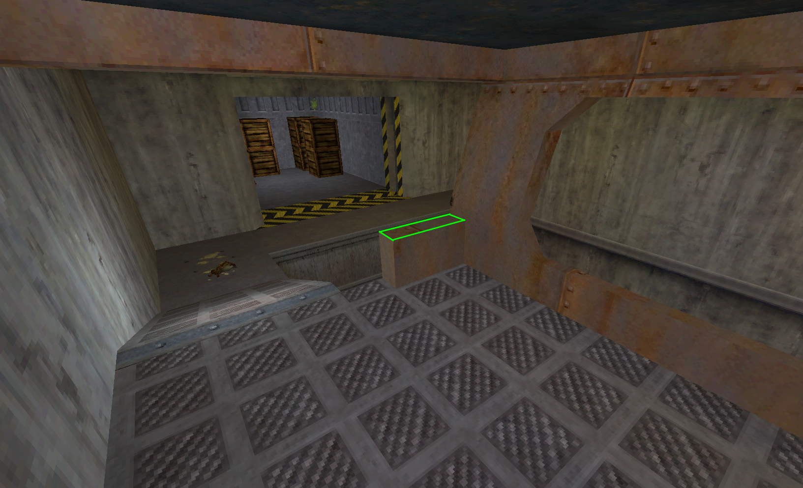
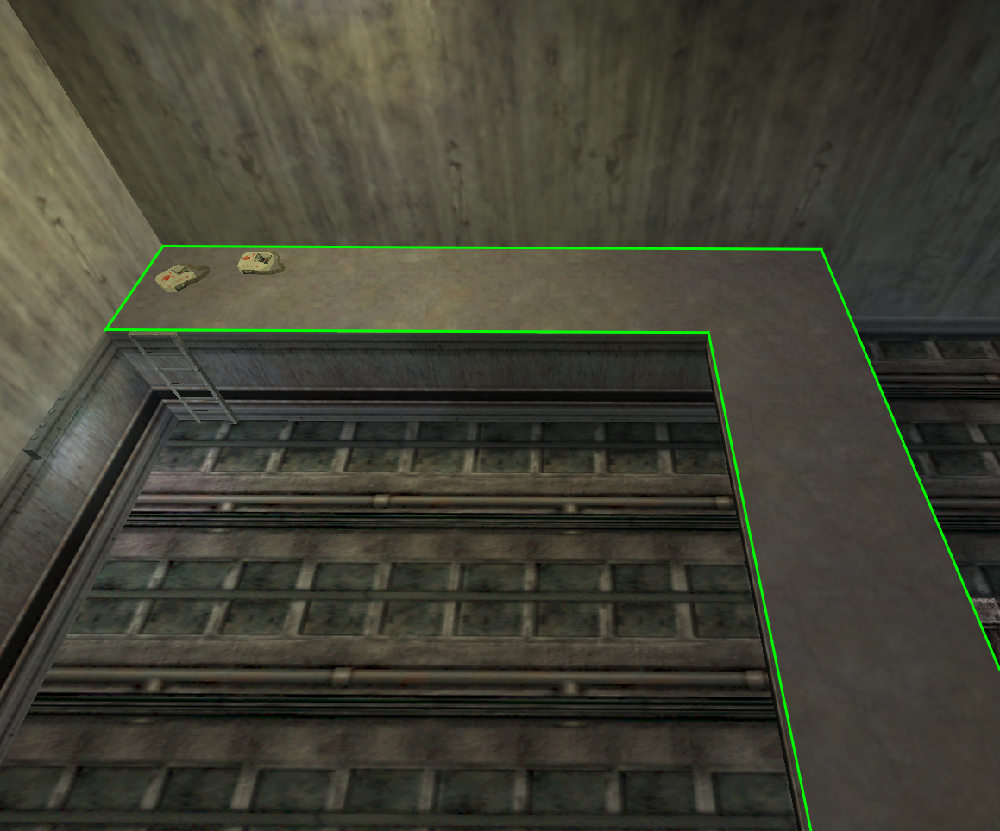
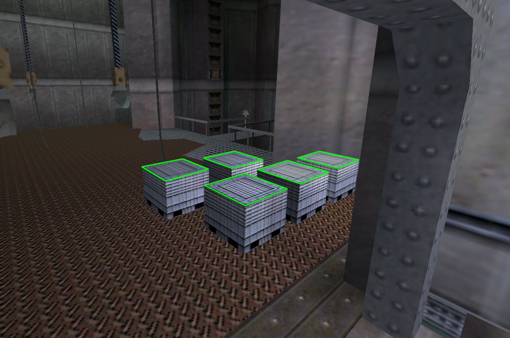
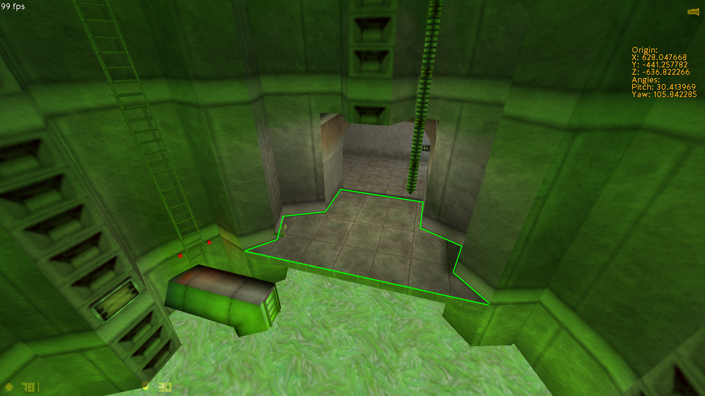
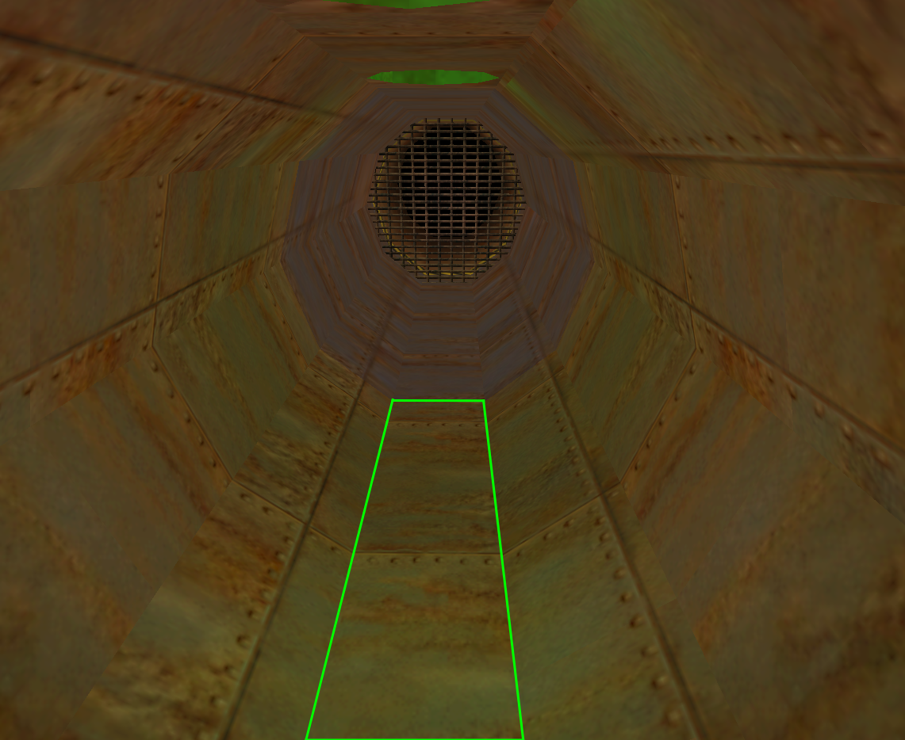

# hl1-scripts
\*some description\*

# Table of Contents
- [Basic scripts](#a-basic-scripts)
  - [Usespam script](#1-usespam-script)
  - [Duckroll/Duckspam](#2-duckroll-aka-duckspam-script)
  - [Fps scripts](#3-fps-scripts)
    - [Hold script](#hold-script)
    - [Toggle script](#toggle-script)
    - [4 fps script](#4-fps-script)
  - [Gauss scripts](#4-gauss-scripts)
    - [180° Gauss boost](#180-gauss-boost)
    - [Slowgauss script](#slowgauss-script)
    - [Gauss script switcher](#gauss-script-switcher)
  - [Object boost scripts](#5-object-boost-scripts)
- [Anomalous Materials](#b-anomalous-materials)
  - [Testchamber scripts](#7-testchamber-scripts)
    - [Testchamber B](#-testchamber-b)
    - [Testchamber N](#-testchamber-n)
    - [Testchamber D](#-testchamber-d)
    - [Testchamber D v2](#-testchamber-d-v2)
- [Unforeseen Consequences](c-unforeseen-consequences)
  - [Object Boost Script](#8-object-boost-script)
- [Office Complex](d-office-complex)
  - [Object Boost Script](#9-object-boost-script)
- [Blast Pit](#e-blast-pit)
  - [Jumpbug Scripts](#10-jumpbugs)
  - [Nade Boost Scripts](#11-nade-boost-scripts)
  - [Hl21 Box Script](#12-hl21-box-script)
- [Power Up](#f-power-up)
  - [ChangeLevel Delay Scripts](#13-changelevel-delay-scripts)
- [On A Rail](g-on-a-rail)
  - [Jumpbug Scripts](#14-jumpbugs)
  - [Object Boost Script](#15-object-boost-script-forward)
- [Apprehension](h-apprehension)
  - [Object Boost Script](#16-object-boost-script-bridge)
- [Residue Processing](#j-residue-processing)
  - [Meatgrab Script](#17-meatgrab-script)
  - [RPClip Script](#18-rpclip-script)
- [Surface Tension](#k-surface-tension)
  - [CLD Scripts](#19-cld-scripts)
  - [P2P Scripts](#20-hl21-p2p-scripts)
  - [Slowgauss Script](#21-slowgauss-after-ihd-door)
  - [Nadeboost](#22-nadeboost-for-new-st-route)
- [Forget About Freeman](#l-forget-about-freeman)
  - [Chairboost Script](#23-chairboost-script)
  - [CLD Scripts](#24-cld-scripts)
- [Lambda Core](#m-lambda-core)
  - [Watergauss Clip Script](#25-watergauss-clip-script)
  - [Smg Boost Scripts](#26-smg-boost-scripts)
- [Xen](#n-xen)
  - [Jumpbug + Viewangle](#27-jumpbugs)

  
## A. **Basic scripts**
### 1. Usespam script
```
alias +usespam "alias _zspecial @use;@use1"
alias -usespam "alias _zspecial;-use"
alias @use1 "+use;alias @use @use2;bxt_append _zspecial"
alias @use2 "w;alias @use @use3;bxt_append _zspecial"
alias @use3 "-use;alias @use @use4;bxt_append _zspecial"
alias @use4 "w;alias @use @use1;bxt_append _zspecial"
```
Example: `bind key +usespam`


### 2. Duckroll (aka Duckspam) Script
*Only use this for waterboosts, `+bxt_tas_ducktap` is much better for movement purposes*
```
alias +duckroll "alias _zspecial @duck;@dr1"
alias -duckroll "alias _zspecial;-duck"
alias @dr1 "+duck;alias @duck @dr2;bxt_append _zspecial"
alias @dr2 "w;alias @duck @dr3;bxt_append _zspecial"
alias @dr3 "-duck;alias @duck @dr4;bxt_append _zspecial"
alias @dr4 "w;alias @duck @dr1;bxt_append _zspecial"
```
Example: `bind key +duckroll`


### 3. Fps scripts
#### Hold script
*If you want other value, just change the first fps value (20 fps on here) and replace `20` with something else in all the aliases (`fps_20`, `+/-fps_20_hold`, `fps_20_reset`)*
```
alias fps_20 "fps_max 20"
alias fps_default "fps_max 100"

alias +fps_20_hold "fps_20; alias -fps_20_hold fps_20_reset"
alias fps_20_reset "fps_default; alias -fps_20_hold"
```
Example: `bind key +fps_20_hold`
#### Toggle script
```
alias fps_20_toggle fps_20_toggle1
alias fps_20_toggle1 "fps_max 20; alias fps_20_toggle fps_20_toggle2"
alias fps_20_toggle2 "fps_max 100; alias fps_20_toggle fps_20_toggle1" 
```
Example: `bind key fps_20_toggle`
#### 4 fps script
```
alias 4fpsbind "fps_max 4; w; fps_max 100"
```
Example: `bind key 4fpsbind`


### 4. Gauss scripts
#### 180° Gauss boost
```
alias _taubo
alias _taubofunc "cl_pitchup 180;cl_pitchdown -180;-attack2;wait;cl_pitchup -12;cl_pitchdown 12;wait;cl_pitchup 89;cl_pitchdown 89"
alias +tau "+attack2; alias _taubo _taubofunc"
alias -tau "_taubo; alias _taubo"
```
Example: `bind key +tau`
#### Slowgauss script
```
alias tauslow "cl_pitchup 180;cl_pitchdown -180;-attack;w 50;cl_pitchup 89;cl_pitchdown 89;force_centerview"
```
Example: `bind key tauslow`
#### Gauss script switcher
```
alias tauswitch tauswitch1
alias tauswitch1 "bind mouse2 +tau; say gaussboost_ON; alias tauswitch tauswitch2"
alias tauswitch2 "bind mouse2 +attack2; say gaussboost_OFF; alias tauswitch tauswitch1"
```
Example: `bind key tauswitch`


### 5. Object Boost Scripts
- ❗Almost all of the object boost scripts use this aliases. So just add all of the aliases here to bottom line of your main scripted config! (Otherwise they won't work when you execute them!)❗
#### 2000 UPS
```
alias obbo2000 "+use;w 11;-use;+jump;w;-jump"
```
Example: `bind key obbo200`
#### 1600 UPS
```
alias obbo1600 "+use;w 10;-use;+jump;w;-jump"
```
Example: `bind key obbo1600`
#### 1300 UPS
```
alias obbo1300 "+use;w 9;-use;+jump;w;-jump"
```
Example: `bind key obbo1300`
#### 1000 UPS
```
alias obbo1000 "+use;w 8;-use;+jump;w;-jump"
```
Example: `bind key obbo1000`
#### 800 UPS
```
alias obbo800 "+use;w 7;-use;+jump;w;-jump"
```
Example: `bind key obbo800`
#### Forward Object Boost (~1300-1400 UPS)
```
alias obboshoot "+use;w 10;-use;+attack2;+jump;w;-attack2;-jump"
```
Example: `bind key obboshoot`


### 6. Wait Table (Bunnymod XT has its own wait table built on it, but some old scripts uses this wait table so you might need it. Just put this at the very bottom of your config.)
<details>
  <summary>📜Expand the list of aliases📜</summary>
  
  ```
alias	"w"			  "wait"
alias	"w1"			"wait"
alias	"w2"			"w;w"
alias	"w3"			"w2;w"
alias	"w4"			"w2;w2"
alias	"w5"			"w4;w"
alias	"w6"			"w3;w3"
alias	"w7"			"w6;w"
alias	"w8"			"w4;w4"
alias	"w9"			"w7;w2"
alias	"w10"			"w5;w5"
alias	"w11"			"w9;w2"
alias	"w12"			"w6;w6"
alias	"w13"			"w9;w4"
alias	"w14"			"w9;w5"
alias	"w15"			"w9;w6"
alias	"w16"			"w9;w7"
alias	"w17"			"w9;w8"
alias	"w18"			"w9;w9"
alias	"w19"			"w9;w10"
alias	"w20"			"w9;w11"
alias	"w21"			"w9;w12"
alias	"w22"			"w9;w13"
alias	"w23"			"w9;w14"
alias	"w24"			"w9;w15"
alias	"w25"			"w9;w16"
alias	"w26"			"w9;w17"
alias	"w27"			"w9;w18"
alias	"w28"			"w9;w19"
alias	"w29"			"w9;w20"
alias	"w30"			"w9;w21"
alias	"w31"			"w9;w22"
alias	"w32"			"w9;w23"
alias	"w33"			"w9;w24"
alias	"w34"			"w9;w25"
alias	"w35"			"w9;w26"
alias	"w36"			"w9;w27"
alias	"w37"			"w9;w28"
alias	"w38"			"w9;w29"
alias	"w39"			"w9;w30"
alias	"w40"			"w9;w31"
alias	"w41"			"w9;w32"
alias	"w42"			"w9;w33"
alias	"w43"			"w9;w34"
alias	"w44"			"w9;w35"
alias	"w45"			"w9;w36"
alias	"w46"			"w9;w37"
alias	"w47"			"w9;w38"
alias	"w48"			"w9;w39"
alias	"w49"			"w9;w40"
alias	"w50"			"w9;w41"
alias	"w51"			"w50;w1"
alias	"w52"			"w50;w2"
alias	"w53"			"w50;w3"
alias	"w54"			"w50;w4"
alias	"w55"			"w50;w5"
alias	"w56"			"w50;w6"
alias	"w57"			"w50;w7"
alias	"w58"			"w50;w8"
alias	"w59"			"w50;w9"
alias	"w60"			"w50;w10"
alias	"w61"			"w50;w11"
alias	"w62"			"w50;w12"
alias	"w63"			"w50;w13"
alias	"w64"			"w50;w14"
alias	"w65"			"w50;w15"
alias	"w66"			"w50;w16"
alias	"w67"			"w50;w17"
alias	"w68"			"w50;w18"
alias	"w69"			"w50;w19"
alias	"w70"			"w50;w20"
alias	"w71"			"w50;w21"
alias	"w72"			"w50;w22"
alias	"w73"			"w50;w23"
alias	"w74"			"w50;w24"
alias	"w75"			"w50;w25"
alias	"w76"			"w50;w26"
alias	"w77"			"w50;w27"
alias	"w78"			"w50;w28"
alias	"w79"			"w50;w29"
alias	"w80"			"w50;w30"
alias	"w81"			"w50;w31"
alias	"w82"			"w50;w32"
alias	"w83"			"w50;w33"
alias	"w84"			"w50;w34"
alias	"w85"			"w50;w35"
alias	"w86"			"w50;w36"
alias	"w87"			"w50;w37"
alias	"w88"			"w50;w38"
alias	"w89"			"w50;w39"
alias	"w90"			"w50;w40"
alias	"w91"			"w50;w41"
alias	"w92"			"w50;w42"
alias	"w93"			"w50;w43"
alias	"w94"			"w50;w44"
alias	"w95"			"w50;w45"
alias	"w96"			"w50;w46"
alias	"w97"			"w50;w47"
alias	"w98"			"w50;w48"
alias	"w99"			"w50;w49"
alias	"w100"		"w50;w50"
alias "w200" 		"w100;w100"
alias "w300" 		"w200;w100"
alias "w350" 		"w300;w50"
alias "w400" 		"w200;w200"
alias "w500"		"w400;w100"
alias	"w600"		"w300;w300"
alias	"w700"		"w600;w100"
alias	"w800"		"w400;w400"
```
</details>


## **B. Anomalous Materials**

### 7. Testchamber Scripts
\*troubleshooting, some common info\*\
**📝You need to execute the config with the script (`bind key "exec tc.cfg`, for example) or press the `testchamber_reset` bind (`-` by default) before doing _any_ attempt📝**

#### 🟢 Testchamber B
*Made by [Parklez](https://github.com/parklez), modified by javac_*
- Semi-automated (manual window landing)
- The most consistent version
- ~1s slower than [Testchamber D](#-testchamber-d)
- Only use this one if you can't get anything else to work
<details>
  <summary>📜Click here to view the script📜</summary>
  
```
alias testchamber "tc1"
alias tmove 
alias testchamber_reset "alias testchamber tc1; alias tmove; say tc_script_reset"

alias tc1 "w 160;alias testchamber tc2; alias tmove +back" //0+9
alias tc2 "alias testchamber tc3; alias tmove +moveright" //0+9
alias tc3 "w 30;+use;w 4;-use;w 40;-moveright;-back;w 100;alias testchamber tc4; alias tmove +left" //0+9
alias tc4 "w 6;-left;w;alias testchamber tc5; alias tmove +moveright" //0+9
alias tc5 "w 22;+use;w 11;-use;+duck;w;-duck;-moveright;w 40;alias testchamber tc6; alias tmove +back" //0+9
alias tc6 "w 13;-back;alias testchamber; alias tmove" //0

bind 0 testchamber
bind 9 tmove
bind - testchamber_reset
```
</details>

<details>
  <summary>📋Usage📋</summary>

- **Angles:**
  - Pitch: `30.0 - 40.0`
  - Yaw: `125.05 - 125.09`
- **Activation timing:**
  - right after the cage starts going down
- **Keypresses**:
  - `0 90 90 90 90 90` (`0` and then `90` five times)
- **Additional actions:**
  - turn to the left after the script is done (after you hit the wall), so you hit the trigger and land on the reactor
  - (optional, but very recommended) do the jumpbug at `23` or `30.3` fps
</details>

[Video link](https://youtu.be/-R4quekIkF4)\
[Practice  save](Practice%20saves/tc_b.sav)


#### 🟡 Testchamber N
*Made by N4Rk0t1k*
- Fully automated
- Very consistent even with fps drops
- 0.3s slower than [Testchamber D](#-testchamber-d)
- Try this one if you have performance issues that prevent you from using version D
<details>
  <summary>📜Click here to view the script📜</summary>
  
```
alias cart preboost1
alias pausespam "w; unpause; w; setpause"
alias longpausespam "pausespam; pausespam; pausespam; pausespam; pausespam; pausespam; pausespam"
alias testchamber_reset "alias cart preboost1; alias mcart; say tc_script_reset"

alias preboost1             "pausable 1; w 5; fps_max 18; w 34; alias cart preboost2; alias mcart +moveright" //0+9
alias preboost2             "+use; w 2; -use; w 12; -moveright; alias cart preboost3; alias mcart +left" //0+9
alias preboost3             "w 5; +use; w 1; -left; w 1; -use; -left; fps_max 99; w 2; alias cart cartboost; alias mcart +moveright" //0+9
alias cartboost             "w 33; +use; w 3; setpause; longpausespam; unpause; -use; w 13; fps_max 30; w 9; alias cart cartfly; alias mcart +right" //0+9
alias cartfly               "w 5; -moveright; -right; alias cart cartlanding1; alias mcart +moveleft" //0+9
alias cartlanding1          "alias mcart +left; alias cart cartlanding2" //0+9
alias cartlanding2          "speak scientist/scream20; fps_max 28.7; w 16; -moveleft; w 44; -left; +bxt_tas_jumpbug; fps_max 10; w 4; -bxt_tas_jumpbug; fps_max 100; alias cart cartwindow; alias mcart +moveright" //0+9
alias cartwindow            "w 30; -moveright; alias cart; alias mcart" //0


bind 0 cart
bind 9 mcart
bind - testchamber_reset
```
</details>

<details>
  <summary>📋Usage📋</summary>
  
- **Angles:**
  - Pitch: `30.0 - 40.0`
  - Yaw: `73.00 - 73.10` (I personally recommend .05 - 0.7, but doesn't really matter)
- **Activation timing:**
  - right after the cage starts going down
- **Keypresses:**
  - (first option) `0 90 90 90 90 90 90` (`0` and then `90` six times), wait until you hear the scientist screaming, then press `90` again and hold `w + ctrl`
  - (second option) `0 90 90 90 90 90 90 90` (`0` and `90` seven times), start holding `w + ctrl` before landing
- **Tips:**
  - Tapping `d` after the level changes helps with landing a lot
</details>

[Video link](https://youtu.be/DnRJmZiLDFM)\
[Practice  save](Practice%20saves/tc_n.sav)


#### 🟠 Testchamber D
*Made by [Parklez](https://github.com/parklez)*
- Fully automated
- May be inconsistent if you have performance issues
<details>
  <summary>📜Click here to view the script📜</summary>
  
```
alias testchamber "tc1"
alias move "+moveright"
alias testchamber_reset "alias testchamber tc1; alias move; say tc_script_reset"

alias tc1 "w 160;alias testchamber tc2;alias move +moveright" //0+9
alias tc2 "alias testchamber tc3;alias move +back" //0+9
alias tc3 "w 30;+use;wait;-moveright;wait;wait;wait;-use;alias testchamber tc4;alias move +moveright" //0+9
alias tc4 "w 70;cl_pitchup -89;+use;w 10;wait;wait;wait;wait;-use;cl_pitchup 89;-moveright;-back;cl_pitchdown 30;w 50;+use;alias testchamber tc5" //0+9
alias tc5 "w 10;wait;wait;wait;wait;-use;w 10;-moveright;w 30;cl_pitchdown 89;alias testchamber tc6;alias move +forward" //0+9
alias tc6 "cl_pitchdown 180;cl_pitchup -170;w 9;cl_pitchup 89;cl_pitchdown 40;wait;cl_pitchdown 89;-forward;w 63;alias testchamber tc7;alias move +moveleft" //0+9
alias tc7 "alias testchamber tc8;alias move +left" //0+9
alias tc8 "w 50;-moveleft;w 100;-left;fps_max 40;w 11;fps_max 100;alias testchamber tc9;alias move +forward" //0+9
alias tc9 "w 40; -forward; alias testchamber; alias move" //0


bind 9 move
bind 0 testchamber 
bind - testchamber_reset
```
</details>

<details>
  <summary>📋Usage📋</summary>
  
- **Angles:**
  - Pitch: `30.0 - 40.0`
  - Yaw: `136.45 - 136.51` (I personally recommend `.50` or `.51`, but doesn't really matter)
- **Activation timing:**
  - right after the cage starts going down
- **Keypresses:**
  - `0 90 90 90 90 90 90 90` (`0` and then `90` seven times), wait until you start turning mid-air (after you hit the trigger), then press `90` again and hold `a + ctrl`**
</details>

[Video link](https://youtu.be/7QxRBDo6F8E)\
[Practice  save](Practice%20saves/tc_d.sav)


#### 🔴 Testchamber D v2
*[Testchamber D](#-testchamber-d) extended by javac_. Thanks to Razzie for the idea*
- Fully automated + extended to 4 fps the UC trigger
- 0.1s faster than [Testchamber D](#-testchamber-d)
- It's not necessary to saveload after the script
<details>
  <summary>📜Click here to view the script📜</summary>
  
```
alias testchamber "tc1"
alias move "+moveright"
alias testchamber_reset "alias testchamber tc1; alias move; say tc_script_reset"

alias tc1 "w 160;alias testchamber tc2;alias move +moveright" //0+9
alias tc2 "alias testchamber tc3;alias move +back" //0+9
alias tc3 "w 30;+use;wait;-moveright;wait;wait;wait;-use;alias testchamber tc4;alias move +moveright" //0+9
alias tc4 "w 70;cl_pitchup -89;+use;w 10;wait;wait;wait;wait;-use;cl_pitchup 89;-moveright;-back;cl_pitchdown 30;w 50;+use;alias testchamber tc5" //0+9
alias tc5 "w 10;wait;wait;wait;wait;-use;w 10;-moveright;w 30;cl_pitchdown 89;alias testchamber tc6;alias move +forward" //0+9
alias tc6 "cl_pitchdown 180;cl_pitchup -170;w 9;cl_pitchup 89;cl_pitchdown 40;wait;cl_pitchdown 89;-forward;w 63;alias testchamber tc7;alias move +moveleft" //0+9
alias tc7 "alias testchamber tc8;alias move +left" //0+9
alias tc8 "w 50;-moveleft;w 100;-left;fps_max 40;w 11;fps_max 100;alias testchamber tc9;alias move +forward" //0+9
alias tc9 "w 40; -forward; alias move +moveleft; alias testchamber tc10" //0+9
alias tc10 "+duck; w 85; -duck; alias move +left; alias testchamber tc11" //0+9
alias tc11 "w 30; fps_max 4; w; fps_max 100; w 5; -moveleft; -left; alias testchamber; alias move" //0


bind 9 move
bind 0 testchamber 
bind - testchamber_reset
```
</details>

<details>
  <summary>📋Usage📋</summary>
  
- **Angles:**
  - Pitch: **30.0 - 40.0**
  - Yaw: **136.45 - 136.51** (I personally recommend .50-.51, but doesn't really matter)
- **Activation timing:**
  - right after the cage starts going down
- **Keypresses:**
  - `0 90 90 90 90 90 90 90` (`0` and then `90` seven times), wait until you start turning mid-air (after you hit the trigger), then press `90 90 90`
</details>

[Video link](https://youtu.be/mnLNYTiTWYs)\
[Practice  save](Practice%20saves/tc_d.sav)


## **C. Unforeseen Consequences**

### 8. Object Boost Script
**For Barrel and bridge**
- ❗The "usekey" in here must be your standard +use key❗

```
alias ucobbo "obbo1500; wait; bind usekey +use"
alias ucobbobind "bind usekey ucobbo"
```
Example `bind key "ucobbobind;say UCobbo"`


## **D. Office Complex**

### 9. Object Boost Script
- **(After headcrab jump but you can also use it with box at the start of blast pit)**
- ❗The "usekey" in here must be your standard +use key❗
```
alias ocobbo "obbo2000; wait; bind usekey +use"
alias ocobbobind "bind space +attack2; bind usekey ocobbo"
```
Example `bind key "ocobbobind;say OCobbo"`


## **E. Blast Pit**

### 10. Jumpbugs
<details>
  <summary>📜Click Here To View Scripts📜</summary>
  
#### 🟢 jb1 (First Elevator)
❗Walk off from the spot holding your script key(DO NOT JUMP SCRIPT WILL NOT WORK)❗
❗Jumpbug spot is shown in the image below❗
```
alias fps_90 "fps_max 90.90909"
alias fps_100 "fps_max 100"
alias +bpjb1 "fps_90; w5; +bxt_tas_jumpbug" 
alias -bpjb1 "-bxt_tas_jumpbug; fps_100"
```
Example: `bind key +bpjb1`

<details>
  <summary>🖼️See Where To Use🖼️</summary>
❗Jumpbug spots highlighted with green lines❗
  
| Walk down (+jumpbug)                | Land                                |
| ----------------------------------- | ----------------------------------- |
|              |             |     

</details>


#### 🟡 jb2 (Second Elevator)
❗Jump off from the spot holding your script key (MAKE SURE YOU HOLD THE SCRIPT KEY BEFORE JUMPING OFF)❗
❗Jumpbug spot is shown in the image below❗
```
alias fps_55 "fps_max 55.55555"
alias fps_100 "fps_max 100"
alias +bpjb2 "fps_55; w20; +bxt_tas_jumpbug" 
alias -bpjb2 "-bxt_tas_jumpbug; fps_100"
```
Example: `bind key +bpjb2`

<details>
  <summary>🖼️See Where To Use🖼️</summary>
❗Jumpbug spots highlighted with green lines❗
  
| Jump down (+jumpbug)                | Land                                |
| ----------------------------------- | ----------------------------------- |
|              |             |     

</details>

#### 🟠 jb3 (from boxes)
❗Jump off from the spot while ducking holding your script key (MAKE SURE YOU ARE CROUCHED AND HOLD THE SCRIPT KEY BEFORE JUMPING OFF)❗
```
alias fps_76 "fps_max 76"
alias fps_100 "fps_max 100"
alias +bpjb3 "fps_76; w20; +bxt_tas_jumpbug" 
alias -bpjb3 "-bxt_tas_jumpbug; fps_100"
```
Example: `bind key +bpjb3`

<details>
  <summary>🖼️See Where To Use🖼️</summary>
❗Jumpbug spots highlighted with green lines❗
  
| Jump down (+jumpbug)                | Land                                |
| ----------------------------------- | ----------------------------------- |
|              |             |     

</details>


#### 🔴 jb4 (Pipe Before Power Up)
```
alias fps_58 "fps_max 58.82353"
alias +bpjb4 "fps_58; w 5; +bxt_tas_jumpbug" 
alias -bpjb4 "-bxt_tas_jumpbug; fps_100"
```
Example: `bind key +bpjb4`

<details>
  <summary>🖼️See Where To Use🖼️</summary>
❗Jumpbug spots highlighted with green lines❗
  
| Jump down (+jumpbug)                | Land                                |
| ----------------------------------- | ----------------------------------- |
|              |             |     

</details>

</details>

### 11. Nade Boost Scripts

#### Maxam's Nade Route
```
alias bp_nade2 "cl_pitchdown 30;cl_pitchup -30;+duck;+jump;wait;-attack;w 15;-jump;-duck;cl_pitchup 89;cl_pitchdown 89;force_centerview; say fps_90"
```
Example: `bind key "bp_nade2"`

<details>
  <summary>📼Video Guide📼</summary>
  
https://github.com/user-attachments/assets/9fdc0f7c-3739-4e50-ac59-0fc1beaa2976

  </details>
  
#### Maxam's Nade Route(From The Slop Version)
- ❗This one is pretty much harder, its recommended to use it only if you have low hp❗
```
alias bp_nade3 "cl_pitchdown 89; cl_pitchup -89; -attack; w; cl_pitchup 89; force_centerview"
```
Example: `bind key "bp_nade3"`

<details>
  <summary>📼Video Guide📼</summary>
  
https://github.com/user-attachments/assets/1d0bab80-0d45-4576-82b3-a7eafec3fe5b

  </details>


#### Tentacle Room Boost 
```
alias bpbutton2 "+attack2; -jump; w; weapon_handgrenade;-attack2; -moveleft; -moveright; weapon_handgrenade; w 20; cl_pitchdown 45; cl_pitchup -45; w 40; -duck; w 30; +use; w 20; -use; w 15; +jump; w; +duck; cl_pitchdown 89; cl_pitchup 89; fps_max 7.5; w 2; -jump; fps_max 100; w 50; -duck"
```
Example: `bind key "bpbutton2"`

<details>
  <summary>📼Video Guide📼</summary>
  
https://github.com/user-attachments/assets/1d0bab80-0d45-4576-82b3-a7eafec3fe5b

  </details>

### 12. Hl21 Box Script
```
alias box1 "fps_max 100; w 100; alias move +left; alias box box2" //k
alias box2 "w 3; -left; alias move +moveright; alias box box3" //l + k
alias box3 "w 22; +use; w 9; -use; w 20; +use; w 6; -use; +duck; w; -duck; w; +duck; +use; w 21; -use; -duck; w 15; +use; w 8; -use; w; +duck; w 25; -duck; w 25; +use; w 6; -use; alias move +forward; alias box box4" //l + k
alias box4 "w 23; +use; w 10; -use; w 5; +use; w 8; -use; w 25; -moveright; w 10; +use; w 4; -use; w 42; -forward; w 30; alias move +moveleft; alias box box5" //l + k
alias box5 "w 10; +use; w 9; -use; -moveleft; alias move +right; alias box box6" //l + k
alias box6 "w 12; -right; w 53; record bp1; alias move +moveleft; alias box box7" //l + k
alias box7 "w 5; alias move +forward; alias box box8" //l + k
alias box8 "w 7; -forward; w 25; -moveleft; w 5; alias move +forward; alias box box9" //l + k
alias box9 "w 2; +use; w 11; +duck; w; -duck; w; -use; alias move +moveright; alias box box10" //l + k
alias box10 "alias move +right; alias box box11" //l + k
alias box11 "w 4; -right; -moveright; -forward; weapon_shotgun; alias move; alias box" //l + k

alias box box1
alias move
```
<details>
  <summary>📋Usage📋</summary>
  
- **bind "k" box** 
- **bind "l" move**
- **You need to re-execute the config with the script after each attempt**
- **Push the box into the corner and stand close to it and the wall.**
- **Pitch doesn't matter much, just aim at the corner of the box** 
- **(make sure you don't aim too high tho otherwise it might not push the box in middle of script).**
- **yaw: 262.41 - 262.70**
- **Press K LK LK LK LK LK LK LK LK LK LK (K once and LK 10 times).**
- **Hold space and make a strafe to the right after changelevel.**
- **You have to press the buttons fast enough. You can press more than 10 times as well it will still work.**
- **You can change the number of waits in alias box1 (every 100 waits = 1 second) if you don't have enough time to press the buttons.**
</details>

<details>
  <summary>📼Video Guide📼</summary>
  
https://github.com/user-attachments/assets/74b9a510-18cd-4087-9d80-1a6206a7d13d

  </details>


## **F. Power Up**
  
### 13. Changelevel Delay Scripts
<details>
  <summary>📜Click Here To View Scripts📜</summary>

#### 🟢 PU CLD (A)
```
alias puskip "-jump;-moveright;-moveleft;speak fvox/power_level_is;w 100;speak fvox/beep;w 100;speak fvox/beep;w 100;speak fvox/beep;w 100;speak fvox/beep;w 100;speak fvox/beep;w 100;speak fvox/beep;cl_pitchdown 180;cl_pitchup -179;w 30;cl_pitchup -30;cl_pitchdown 31;wait;cl_pitchup 89;cl_pitchdown 89;w 10;+use;w 11;-use;+jump;wait;-jump"
```
<details>
  <summary>📼Video Guide📼</summary>

[link](https://www.youtube.com/watch?v=IkZ4wWKrLVg)

</details>
Example: `bind key puskip`

#### 🟡 Power Up B
*Facing forward, no object boost.*
```
alias puskip "speak fvox/power_level_is;w 100;speak fvox/beep;w 100;speak fvox/beep;w 100;speak fvox/beep;w 100;speak fvox/beep;w 100;speak fvox/beep;w 50"
```
Example: `bind key puskip`
<details>
  <summary>📋Usage📋</summary>
Walk forward and activate the script as you walk across the level change trigger, grab the tripmines and wait against the wall.
</details>

<details>
  <summary>📼Video Guide📼</summary>
  
https://github.com/user-attachments/assets/8d3c27d7-fe0a-4d13-93c8-b15fb38b651f

  </details>

#### 🟠 PU CLD (C) [Faster One, has less delay)
*Facing forward, with object boost!*
```
alias puskip "weapon_shotgun;-jump;-moveright;-moveleft;w 280;+use;w 8;-use;+jump;wait;-jump;+attack2;wait;-attack2;+duck;w 27;-duck"
```
Example: `bind key puskip`

<details>
  <summary>📼Video Guide📼</summary>
  
https://github.com/user-attachments/assets/da8c89b5-4c03-410e-9288-c8070bfe3e45

  </details>

#### 🔴 PU CLD (C) [Slower One, has more delay]
*Facing forward, with object boost!*
```
alias puskip "weapon_shotgun;-jump;-moveright;-moveleft;w 350;+use;w 12;-use;+jump;wait;-jump;+attack2;wait;-attack2;+duck;w 28;-duck"
```
Example: `bind key puskip`

<details>
  <summary>📼Video Guide📼</summary>
  
[link](https://clips.twitch.tv/PuzzledTangentialClipsdadRickroll)
  
</details>


## **G. On A Rail**

### 14. Jumpbugs
<details>
  <summary>📜Click Here To View Scripts📜</summary>
  
#### 🟢 Jumpbug for right before nade rails
  
```
alias fps_41 "fps_max 41.66666"
alias +oarjb1 "fps_41; w5; +bxt_tas_jumpbug" 
alias -oarjb1 "-bxt_tas_jumpbug; fps_100"
```
Example: `bind key +oarjb1`

<details>
  <summary>🖼️See Where To Use🖼️</summary>
❗Jumpbug spots highlighted with green lines❗
  
| Jump down (+jumpbug)                | Land                                |
| ----------------------------------- | ----------------------------------- |
|              |             |     

</details>

<details>
  <summary>📼Video Guide📼</summary>

https://github.com/user-attachments/assets/8941b401-79c4-45bb-baee-cb370f084e6d

  </details>
 
#### 🟡 Jumpbug for after launching the rocket
- ❗Its recommended to do tankbox instead of using this script, unless you don't want to take the armor for rp clip route❗ 
```
alias fps_90 "fps_max 58.82353"
alias fps_100 "fps_max 100"
alias +oarjb2 "fps_90; w5; +bxt_tas_jumpbug"
alias -oarjb2 "-bxt_tas_jumpbug; fps_100" 
```
Example: `bind key +oarjb2`

  <summary>📼Video Guide📼</summary>

https://github.com/user-attachments/assets/871d363d-d7ec-437e-bf92-d3d72bf17d74

  </details>

</details>


### 15. Object Boost Script (Forward)
- ❗This script will use shotgun automatically, also remember it will rebind your key to +use back again, in case you fail execute again❗
- ❗The "usekey" in here must be your standard +use key❗
```
alias oarobbo "obbo2000; wait; +attack2; wait; -attack2; wait; bind usekey +use"
alias oarobbobind "bind usekey oarobbo"
alias noi "say oarobbo rdy"
```
Example: `bind key "oarobbobind; noi"`

  <summary>📼Video Guide📼</summary>

https://github.com/user-attachments/assets/6a65b678-a4a4-4c22-9e75-0c507d95fc6c

  </details>


## **H. Apprehension**

### 16. Object Boost Script (Bridge)
- ❗The "usekey" in here must be your standard +use key❗
```
alias obbo1500rebind "+use;w10;-use;+jump;w;-jump; bind usekey +use"
```
Example: `bind key "bind usekey obbo1500rebind; say obbo1500rebind`


## **J. Residue Processing**

### 17. Meatgrab Script
```
alias mg mg1
alias mg1 "+duck;w 50;alias mg mg2"
alias mg2 "+use;w 18;-use;fps_max 100;w 30;-duck;w 35; +jump; w 10; -jump; alias mg mg1"
```
📋Usage📋: `bind key mg` `key + +moveright(hold a bit) + key`

### 18. RPClip Script
```
alias rpclip "cl_pitchdown 89;cl_pitchup -89;fps_max 20.2;+attack;w;weapon_crowbar;-attack;w32;+jump;-forward;weapon_handgrenade;w;-jump;+duck;w20;cl_pitchdown 89;cl_pitchup -89;w 10;fps_max 20;w4;-duck;fps_max 100;cl_pitchdown 89;cl_pitchup 89"
```
📋Usage📋: `bind key "rpclip"` `Hold +forward before and execute the script`

## **K. Surface Tension**

### 19. CLD Scripts
<details>
  <summary>📜Click Here To View Scripts📜</summary>

#### 🟢 Fast CLD Script
- ❗If you want to change keybinds, pay attention to the order❗
```
bind j sst
bind h sstmove

alias sst sst1
alias sstmove

alias sst1 "weapon_gauss; w 50; fps_max 100; +attack2; alias sstmove +forward; alias sst sst2"
alias sst2 "w 20; alias sstmove +moveleft; alias sst sst3"
alias sst3 "w 90; -moveleft; w 10; -forward; alias sst sst4"
alias sst4 "alias sstmove +left; alias sst sst5"
alias sst5 "w 10; +jump; w 28; -left; -moveleft; w 15; tau; w 10; +attack2; w 40; alias sstmove +moveright; alias sst sst6"
alias sst6 "alias sstmove +right; alias sst sst7"
alias sst7 "alias sstmove; w 30; -moveright; -right; tau; w 25; -jump; cl_pitchdown 89; cl_pitchup -89; w 22; weapon_shotgun; cl_pitchup 89; alias sst"
```

#### 🟡 Slow CLD Script
- ❗If you want to change keybinds, pay attention to the order❗
```
//valve script

alias tau "cl_pitchup 180;cl_pitchdown -180;-attack2;wait;cl_pitchup 89.999;cl_pitchdown 89.999;force_centerview"

alias stskip st1
alias stmove +forward
alias st1 "weapon_gauss;+duck;w 146;-duck;-forward;alias stskip st2;alias stmove +moveright"
alias st2 "+attack2;w 150;-moveright;+use;w 2;-use;alias stskip st3;alias stmove +forward"
alias st3 "w 15;+jump;tau;-forward;w 60;alias stskip st4;alias stmove +moveright"
alias st4 "w 26;-right;-moveright;w 30;-jump;cl_pitchup -89.999;cl_pitchdown 89.999;w 44;cl_pitchup 89.999;cl_pitchdown 89.999;weapon_shotgun;save autosave;alias stskip st1;alias stmove +forward;save autosave"

bind f12 stskip //3
bind f11 stmove //2
bind f10 +right //1
```
📋Usage📋: 
</details>

### 20. HL21 P2P Scripts

<details>
  <summary>📜Click Here To View Scripts📜</summary>

#### 🟢 Jorik's P2P Script
- ❗You must edit ptpsens value to your normally used sensitivity value❗
- ❗If you are too slow at pressing keys, increase ptpdelay value❗
- ❗If you want to change keybinds, pay attention to the order❗
```
alias ptpscript ptp0
alias ptpmove1 +moveleft
alias ptpmove2 +forward
alias ptptau "cl_pitchup 180;cl_pitchdown -180;-attack2;wait;cl_pitchup 89;cl_pitchdown 89;force_centerview"
alias ptpre "-forward;-moveleft;-moveright;-duck;-jump;-right;-left;-attack2;ptpsens;alias ptpscript ptp0;alias ptpmove2 +forward;alias ptpmove1 +moveleft" // use if you failed keys order
alias ptpsens "sensitivity 0.6" // change it (sensitivity after script done)
alias ptpdelay "w 200" // change it (start delay, increase it if you dont have time to press keys, every w 100 = 1 sec)

alias ptp0 "sensitivity 0;ptpdelay;alias ptpscript ptp1"
alias ptp1 "+attack2;w 52;-forward;-moveleft;+jump;alias ptpscript ptp2;alias ptpmove2 +moveright"
alias ptp2 "+duck;w 70;-moveright;alias ptpscript ptp3;alias ptpmove2 +moveleft"
alias ptp3 "-jump;w 20;-moveleft;-duck;alias ptpscript ptp4;alias ptpmove2 +right"
alias ptp4 "w 38;-right;w 10;alias ptpscript ptp5;alias ptpmove2 +moveleft"
alias ptp5 "w 18;-moveleft;w 10;force_centerview;alias ptpscript ptp6;alias ptpmove2 +forward"
alias ptp6 "w 16;ptptau;w;-forward;alias ptpscript ptp7;alias ptpmove2 +moveright"
alias ptp7 "w 10;+attack2;w 70;alias ptpscript ptp8;alias ptpmove2 +right"
alias ptp8 "w 6;-right;-moveright;alias ptpscript ptp9;alias ptpmove2 +back"
alias ptp9 "w 2;-back;+jump;w 70;alias ptpscript ptp10;alias ptpmove2 +left"
alias ptp10 "w 5;-left;-moveleft;-jump;ptptau;w;save autosave;w 71;alias ptpscript ptp11;alias ptpmove2 +right;alias ptpmove1 +moveright"
alias ptp11 "w 4;-right;w 2;-moveright;+duck;w 10;fps_max 20;+use;w 4;-duck;fps_max 100;w 15;-use;ptpsens;alias ptpscript ptp0;alias ptpmove2 +forward;alias ptpmove1 +moveleft"

bind k ptpscript
bind j ptpmove2
bind h ptpmove1


```
<details>
  <summary>📼Video Guide📼</summary>
  
  https://github.com/user-attachments/assets/ffbffe26-d0c3-4f61-983f-51a2d8b2e2bd
  
  </details>
  

<details>
  <summary>📋Usage📋</summary>
  
- Start manually charge gauss when you entered map
- Go to the corner i showed in the video
- Aim at the corner i showed in the video (yaw is ~268.70 - ~268.90 , pitch almost doesnt matter but its around 6.0)
- Press keys in order after you aimed (and release +attack2 key after you pressed first script key):
  -  k
  - h j k
  - j k (8x)
  - h j k (2x) 
 </details>

 #### 🟡 Javac's Hole In One P2P Script

 </details>

 ### 21. Slowgauss After Ihd Door
 ```
alias tausloo "cl_pitchup 180;cl_pitchdown -180;-attack;w50;cl_pitchup 89.999;cl_pitchdown 89.999;force_centerview"
```
Example: `bind key tausloo`

### 22. Nadeboost For New ST Route
```
alias boostx "+duck;w19;cl_pitchup -96;cl_pitchdown -180;wait;+attack2;wait;-attack2;w2;-duck;cl_pitchup 89.999;cl_pitchdown 89.999;force_centerview"
```
Example: `bind key boostx`

## **L. Forget About Freeman**

### 23. Chairboost Script
- ❗The "usekey" in here must be your standard +use key❗
  ```
  alias fafobbo "obbo1300; wait; bind e +use"
  ```
Example: `bind key "bind usekey fafobbo; say fafobbo"`

### 24. CLD Scripts

<details>
  <summary>📜Click Here To View Scripts📜</summary>

#### 🟢 Smg CLD
```
alias "faf_e" "fps_max 100; save autosave; weapon_crowbar; -moveleft; +attack;w 350;-attack;force_centerview;weapon_9mmAR;cl_pitchdown 180;cl_pitchup -179;w 40;cl_pitchup 89;cl_pitchdown 89;w 30;+jump;+duck;w;cl_pitchdown 136;cl_pitchup -135;-forward;+attack2;w 30;-attack2;cl_pitchup 89;cl_pitchdown 89;force_centerview;-jump;-duck;w 10;+duck;w 16;-duck; weapon_hornetgun"
```
Example: `bind key faf_e`

<details>
  <summary>📼Video Guide📼</summary>
  
  
  </details>

#### 🟡 Smg CLD with fast ladder climb


#### 🟠 Grenade CLD
```
alias faf "save quick;speak fvox/power_level_is.beep._comma.beep._comma.beep._comma.beep;-moveright;-moveleft;-duck;weapon_crowbar;+attack;w 500;weapon_handgrenade;w 40;cl_pitchdown 180;cl_pitchup -179;w 40;cl_pitchup 89.999;cl_pitchdown 89.999;cl_pitchup -40;cl_pitchdown 40.001;w 30;-attack;w 4;+jump;+duck;wait;-jump;-duck;cl_pitchup 89;cl_pitchdown 89;w 61"
```
Example: `bind key faf`
Video guide: [link](https://www.youtube.com/watch?v=E4h4jmzd-gI)\

#### 🔴 Grenade CLD + Smg nade to scare vortigaunts
```
alias faf "w 400;smg;w 1;weapon_handgrenade;w 10;+attack;w 50;cl_pitchdown 180;cl_pitchup -179;w 40;cl_pitchup 89.999;cl_pitchdown 89.999;cl_pitchup -40;cl_pitchdown 40.001;w 30;-attack;w 4;+jump;+duck;w 1;-jump;-duck;cl_pitchup 89.999;cl_pitchdown 90;w 61"
alias smg "cl_pitchdown 180;cl_pitchup -179;w 1;+attack2;w 1;cl_pitchup 89;cl_pitchdown 89;-attack2"
```
📋Usage📋: `same as grenade cld but cook the grenade and switch to the SMG before activating.`
Example: `bind key faf`

</details>

## **M. Lambda Core**
- ❗If you don't have enough time to get into the corner, increase alias "dst" value❗
### 25. Watergauss Clip Script

```
alias _taubow
alias _taubofuncw "cl_pitchup 180;cl_pitchdown -180;-attack;wait;cl_pitchup -12;cl_pitchdown 12;wait;cl_pitchup 89.999;cl_pitchdown 89.999"
alias +tauw "+attack; alias _taubow _taubofuncw"
alias -tauw "_taubow; alias _taubow"

alias fps_20 "fps_max 20"
alias fps_100 "fps_max 100"
alias +wc "+duck;w;-duck;w5;+duck;w30;-duck;w60;gwc;w10;wwc"
alias -wc "-tauw;-attack2;"
alias wwc "fps_20;dst;-forward;-moveright;-wc;w;fps_100;weapon_handgrenade"
alias gwc "w5;-attack2;+tauw;w;"
alias dst "w8" (WAITING VALUE FOR SHOOTING. INCREASE IT IF YOU DONT HAVE ENOUGH TIME)
```

<details>
  <summary>📼Video Guide📼</summary>
  
https://github.com/user-attachments/assets/bce50158-6c12-410f-a647-aedc00a3a27b

  </details>
  
Example: `bind key "+wc"`

### 26. Smg Boost Scripts


## **N. Xen**

### 27. Jumpbugs

#### 🟢 Viewsnap + Fps switch
- ❗Change xenv_sens value to your normal sensitivity value before use❗
```
bind f1 xenv // script bind
bind o +bxt_tas_jumpbug // jumpbug bind

alias xenv_sens "sensitivity 2.37" // your default sens

alias xenv xenv1
alias xenv1 "+attack2; w 10; weapon_gauss; +attack2; +duck; bxt_autopause 1; fps_max 97; cl_pitchup -35.83; cl_pitchdown 35.83; m_pitch 0; sensitivity 1819.54545; say xen_strat; xenv_reset; alias xenv xenv2"
alias xenv2 "sensitivity 0; unpause; +attack2; w 10; -attack2; fps_max 97; w 40; w 10; -duck; bxt_autopause 0; xenv_sens; cl_pitchup 89; cl_pitchdown 89; m_pitch 0.022; fps_max 33.33333; alias xenv xenv1"
```
<details>
  <summary>📋Usage📋</summary>
  
- Go through portal and immediately start charging
- Meanwhile charging press the script bind (❗you can release attack2 after pressing keybind script will charge itself!❗)
- After changelevel, game will be autopaused, set viewangle, unpause the game, and hold your jumpbug bind to hit the jumpbug
  
  </details>

#### 🟡 Viewsnap (Fully automatic) [❗NOT RECOMMENDED, VERY INCONSISTENT❗]
```
bind f1 xenv

alias xenv_sens "sensitivity 2.37"
alias xenv_binds_set "bind 2 xenv_dolb; bind 3 xenv_mv1; bind 4 xenv_mv2"
alias xenv_binds_def "bind 2 slot2; bind 3 weapon_9mmAR; bind 4 weapon_shotgun"

alias xenv_reset "alias xenv_dolb xenv_dolb1; alias xenv_mv1 +moveright; alias xenv_mv2 +left"
alias xenv "+duck; bxt_autopause 1; fps_max 97; cl_pitchup -35.83; cl_pitchdown 35.83; m_pitch 0; sensitivity 1819.54545; say xen_strat; xenv_reset; xenv_binds_set"

alias xenv_dolb1 "sensitivity 0; unpause; +attack2; w 10; -attack2; fps_max 97; r_norefresh 1; w 40; +attack2; w 10; alias xenv_dolb xenv_dolb2"
alias xenv_dolb2 "w 14; -duck; w 58; -moveright; w 4; -attack2; w 85; -left; w 63; alias xenv_mv1 +moveleft; alias xenv_dolb xenv_dolb3"
alias xenv_dolb3 "w 13; -left; -moveleft; +bxt_tas_jumpbug; bxt_autopause 0; w 30; -bxt_tas_jumpbug; r_norefresh 0; xenv_sens; cl_pitchup 89; cl_pitchdown 89; m_pitch 0.022; fps_max 100; weapon_shotgun; alias xenv_mv1; alias xenv_mv2; xenv_binds_def"
```
<details>
  <summary>📋Usage📋</summary>
  
- First change the sensitivity in xenv_sens
- And change xenv_binds_set (the script keys) and xenv_binds_def (your normal weapon binds)
- Press xenv key before the changelevel after entering the portal. DON'T HOLD +DUCK, IT'LL BREAK THE SCRIPT!
- Set viewangle
- Press in order (for keys 1=xen_dolb 2=xenv_mv1 3=xenv_mv2):
  - 123 (2x)
  - 1
  
  </details>
  


  


 

 


